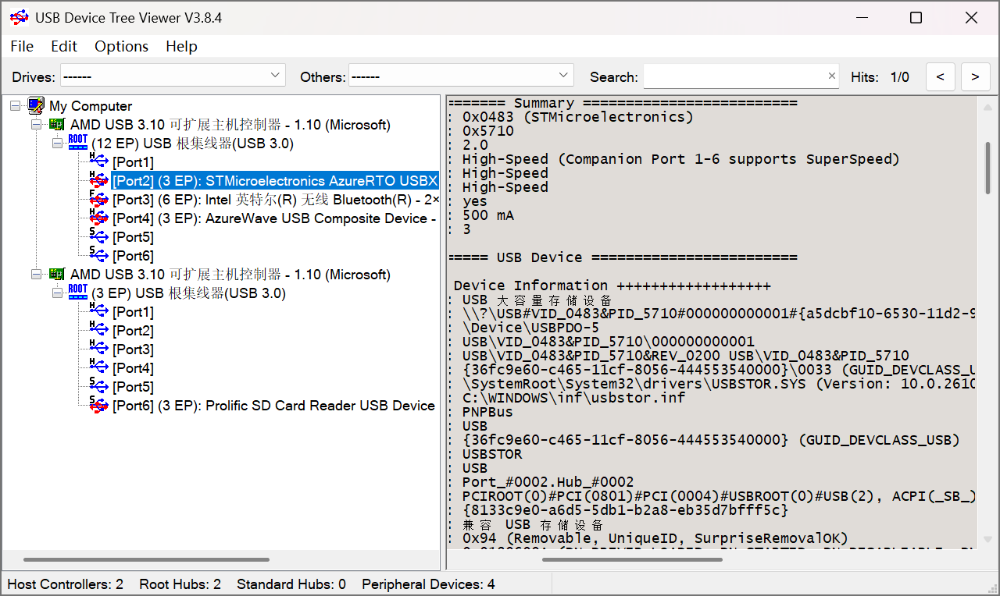
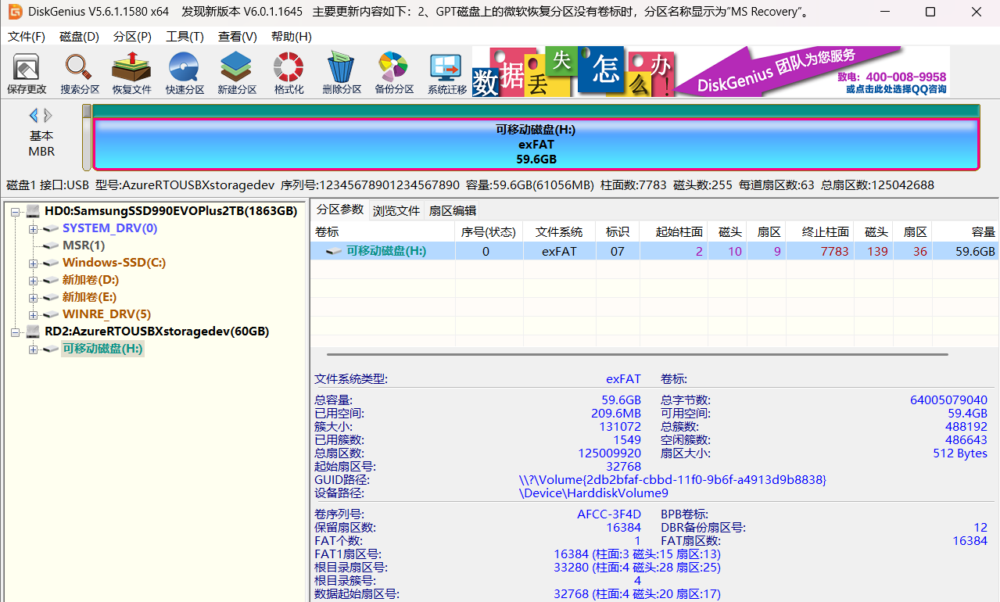
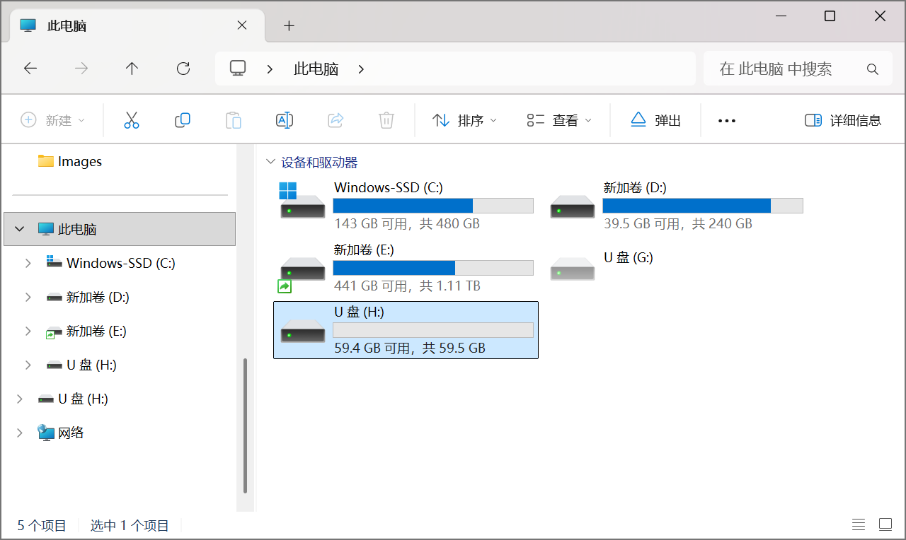
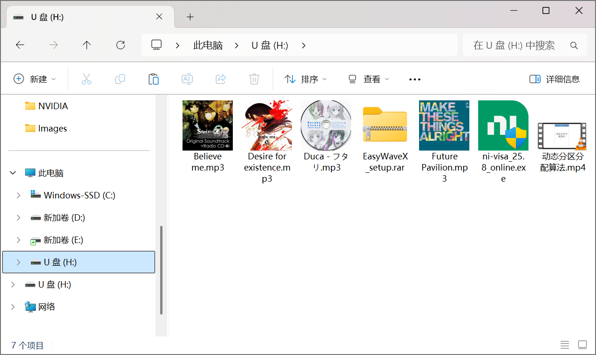
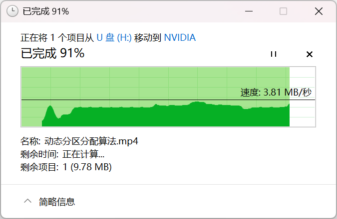
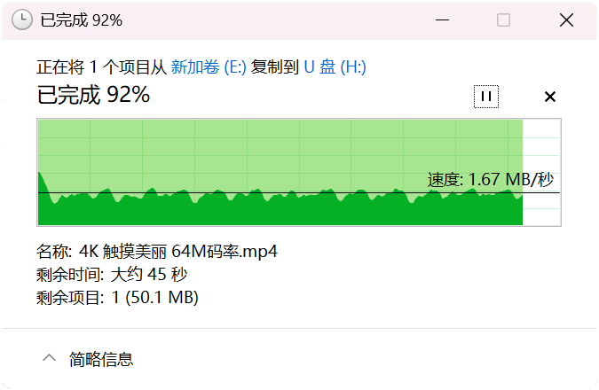
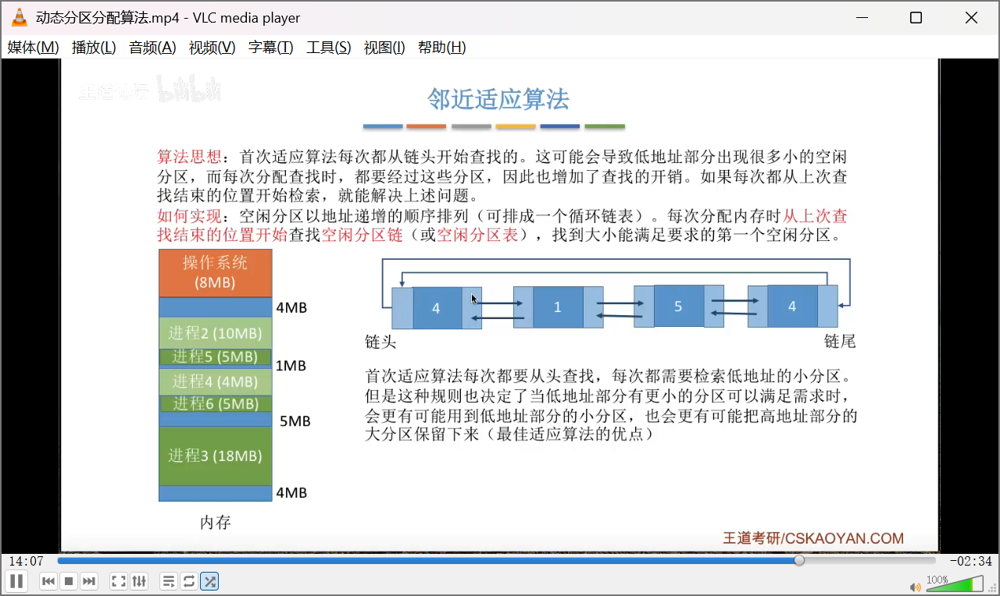
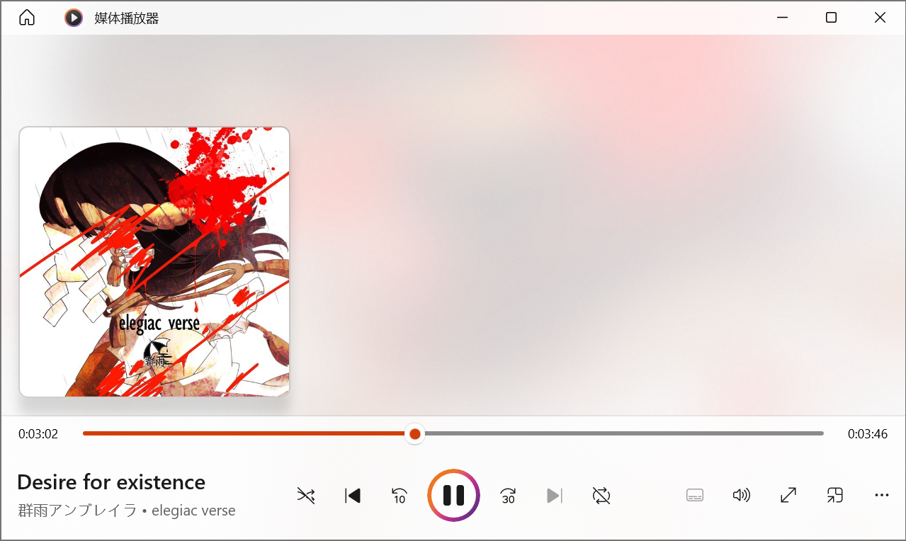

## H723ZGTx144_ThreadX_USBX_MSC_01

## 关于

参考

- [帖子：V7_STM32CubeMX简易教程 ThreadX_Cache_FileX_USBX+SD卡+USB Device MSC](https://forum.anfulai.cn/forum.php?mod=viewthread&tid=128791&highlight=USBX%2BMSC)
- [贴子：作者的开源工程仓库](https://gitee.com/yangkangjia2718/armbbs-sd-usb-device-msc.git)

软件

- RTOS：ThreadX

- USBX：MSC类

- FileX：SD卡驱动

- 编译：GCC，Os优化

- 使用 SD 卡 DMA 读写 API

  > 在 ux_device_msc.c 中
  >
  > USBD_STORAGE_Read() 调用 HAL_SD_ReadBlocks_DMA()
  >
  > USBD_STORAGE_Write() 调用 HAL_SD_WriteBlocks_DMA()

- SDMMC2：使能了硬件流控，时钟频率 50MHz

- AXISRAM：[参考硬汉教程配置为最低性能NORMAL](https://www.cnblogs.com/armfly/p/16245867.html)

  ```c
    MPU_InitStruct.Enable = MPU_REGION_ENABLE;
    MPU_InitStruct.Number = MPU_REGION_NUMBER0;
    MPU_InitStruct.BaseAddress = 0x24000000;
    MPU_InitStruct.Size = MPU_REGION_SIZE_512KB;
    MPU_InitStruct.SubRegionDisable = 0;
    MPU_InitStruct.TypeExtField = MPU_TEX_LEVEL1;
    MPU_InitStruct.AccessPermission = MPU_REGION_FULL_ACCESS;
    MPU_InitStruct.DisableExec = MPU_INSTRUCTION_ACCESS_ENABLE;
    MPU_InitStruct.IsShareable = MPU_ACCESS_NOT_SHAREABLE;
    MPU_InitStruct.IsCacheable = MPU_ACCESS_NOT_CACHEABLE;
    MPU_InitStruct.IsBufferable = MPU_ACCESS_NOT_BUFFERABLE;
  ```

硬件

- USB高速PHY：USB3300
- SD卡：三星 64G EVO（C10）

SD卡格式化工具

- SD Card Formatter 格式化为 exFAT

下载到开发板后，WIN11 25H2 正常识别到一块 59.4G的U盘

## 关键修改点

### main.c

获取 SD 卡信息，后续 USBD_STORAGE_GetMediaLastLba() 和 USBD_STORAGE_GetMediaBlocklength() 向电脑发送 U盘的信息得用到

```c
int main(void)
{
......
  /* Get SD card info 存到 hsd2 里
   * 供后续 USBD_STORAGE_GetMediaLastLba() 和 USBD_STORAGE_GetMediaBlocklength() 获取信息
   */
  status = HAL_SD_GetCardInfo(&hsd2, &USBD_SD_CardInfo);

  if (status != HAL_OK)
  {
    Error_Handler();
  }
......
```

### app_filex.c

临时挂起 fx_app_thread 任务

```c
void fx_app_thread_entry(ULONG thread_input)
{
......
  /* USER CODE BEGIN fx_app_thread_entry 0 */
  /**
   * https://forum.anfulai.cn/forum.php?mod=viewthread&tid=128791&highlight=usbx%2Bmsc
   * 原帖作者说到：FileX和USBX都开启，会有资源访问冲突的问题，我这边的临时解决方案是挂起FileX相关任务。后边可能会使用互斥信号量来解决。
   *
   * 我实测，加这个才会 Os 优化编译弹出 有容量的磁盘
   */
  tx_thread_suspend(&fx_app_thread);
  /* USER CODE END fx_app_thread_entry 0 */
......
```

### fx_stm32_sd_driver_glue.c

在中断回调函数中释放信号量，并设置 EventFlag 事件标志组，用于实现 USBD_STORAGE_Read() 和 USBD_STORAGE_Write() 等待 DMA将上次数据读写完毕后再读写读下次数据

```c
void HAL_SD_TxCpltCallback(SD_HandleTypeDef *hsd)
{
  /* USER CODE BEGIN PRE_TX_CMPLT */
 // 非阻塞DMA情况读写SD卡API完成后此中断回调函数会被调用
  /* USER CODE END PRE_TX_CMPLT */

  tx_semaphore_put(&sd_tx_semaphore);

  /* USER CODE BEGIN POST_TX_CMPLT */
  if (tx_event_flags_set(&EventFlag, SD_WRITE_FLAG, TX_OR) != TX_SUCCESS)
  {
    Error_Handler();
  }
  /* USER CODE END POST_TX_CMPLT */
}

void HAL_SD_RxCpltCallback(SD_HandleTypeDef *hsd)
{
  /* USER CODE BEGIN PRE_RX_CMPLT */

  /* USER CODE END PRE_RX_CMPLT */

  tx_semaphore_put(&sd_rx_semaphore);

  /* USER CODE BEGIN POST_RX_CMPLT */
  if (tx_event_flags_set(&EventFlag, SD_READ_FLAG, TX_OR) != TX_SUCCESS)
  {
    Error_Handler();
  }
  /* USER CODE END POST_RX_CMPLT */
}

```

### ux_device_msc.c

获取 EventFlag 事件标志组，防止 DMA 还没传输完毕就进行下一次读写操作

```c
UINT USBD_STORAGE_Read(VOID *storage_instance, ULONG lun, UCHAR *data_pointer,
                       ULONG number_blocks, ULONG lba, ULONG *media_status)
{
  UINT status = UX_SUCCESS;

  /* USER CODE BEGIN USBD_STORAGE_Read */
  UX_PARAMETER_NOT_USED(storage_instance);
  UX_PARAMETER_NOT_USED(lun);
  UX_PARAMETER_NOT_USED(media_status);

  ULONG ReadFlags = 0U;

  /* Check if the SD card is present */
//  if (HAL_GPIO_ReadPin(GPIOF, GPIO_PIN_5) != GPIO_PIN_RESET)
//  {
    /* Check id SD card is ready */
    if(check_sd_status() != HAL_OK)
    {
      _Error_Handler(__FILE__, __LINE__);
    }

    /* Start the Dma write */
    status =  HAL_SD_ReadBlocks_DMA(&hsd2, data_pointer, lba, number_blocks);
    if(status != HAL_OK)
    {
      _Error_Handler(__FILE__, __LINE__);
    }

    /* Wait on readflag until SD card is ready to use for new operation */
    if (tx_event_flags_get(&EventFlag, SD_READ_FLAG, TX_OR_CLEAR,
                           &ReadFlags, TX_WAIT_FOREVER) != TX_SUCCESS)
    {
      _Error_Handler(__FILE__, __LINE__);
    }
//  }

  /* USER CODE END USBD_STORAGE_Read */

  return status;
}

UINT USBD_STORAGE_Write(VOID *storage_instance, ULONG lun, UCHAR *data_pointer,
                        ULONG number_blocks, ULONG lba, ULONG *media_status)
{
  UINT status = UX_SUCCESS;

  /* USER CODE BEGIN USBD_STORAGE_Write */
  UX_PARAMETER_NOT_USED(storage_instance);
  UX_PARAMETER_NOT_USED(lun);
  UX_PARAMETER_NOT_USED(media_status);

  ULONG WriteFlags = 0U;

  /* Check if the SD card is present */
//  if (HAL_GPIO_ReadPin(GPIOF, GPIO_PIN_5) != GPIO_PIN_RESET)
//  {
    /* Check if SD card is ready */
    if(check_sd_status() != HAL_OK)
    {
      _Error_Handler(__FILE__, __LINE__);
    }

    /* Start the Dma write */
    status = HAL_SD_WriteBlocks_DMA(&hsd2, data_pointer, lba, number_blocks);

    if(status != HAL_OK)
    {
      _Error_Handler(__FILE__, __LINE__);
    }

    /* Wait on writeflag until SD card is ready to use for new operation */
    if (tx_event_flags_get(&EventFlag, SD_WRITE_FLAG, TX_OR_CLEAR,
                           &WriteFlags, TX_WAIT_FOREVER) != TX_SUCCESS)
    {
      _Error_Handler(__FILE__, __LINE__);
    }
//  }

  /* USER CODE END USBD_STORAGE_Write */

  return status;
}

ULONG USBD_STORAGE_GetMediaLastLba(VOID)
{
  ULONG LastLba = 0U;

  /* USER CODE BEGIN USBD_STORAGE_GetMediaLastLba */
#if 1
  LastLba = (ULONG)(USBD_SD_CardInfo.BlockNbr - 1);
#else // 等价写法
  LastLba = (ULONG)(hsd2.SdCard.BlockNbr -1);
#endif
  /* USER CODE END USBD_STORAGE_GetMediaLastLba */

  return LastLba;
}

ULONG USBD_STORAGE_GetMediaBlocklength(VOID)
{
  ULONG MediaBlockLen = 0U;

  /* USER CODE BEGIN USBD_STORAGE_GetMediaBlocklength */
#if 1
  MediaBlockLen = (ULONG) USBD_SD_CardInfo.BlockSize;
#else // 等价写法
  MediaBlockLen = (ULONG) hsd2.SdCard.BlockSize;
#endif
  /* USER CODE END USBD_STORAGE_GetMediaBlocklength */

  return MediaBlockLen;
}
```

## 一些思考

### 为什么 ux_device_msc.c 调用 HAL SD DMA 读写函数没有看到解决4字节对齐的代码？

贴子参见：

- [STM32H7的SDIO自带的DMA控制器数据传输的地址是强制4字节对齐，这就非常不方便了](https://forum.anfulai.cn/forum.php?m ... id=94066&fromuid=58)
- [ST这骚操作，解决H7的SDIO DMA的4字节对齐问题，搞了个复制粘贴](https://forum.anfulai.cn/forum.php?mod=viewthread&tid=100130)

 ux_device_msc.c 中

- USBD_STORAGE_Read() 调用 HAL_SD_ReadBlocks_DMA()
- USBD_STORAGE_Write() 调用 HAL_SD_WriteBlocks_DMA()

因为 CubeMX 中 USBX 的 UX_ALIGN_MIN 默认是 Align 8，即分配的内存以8字节对齐

## Demo

可以正常CRUD各种文件，例如打开文本文件，编辑内容后保存、重命名文件等（支持中文）

|            |              |
| ------------------------------------------------------------ | ------------------------------------------------------------ |
| UsbTreeView                                                  | DiskGenius                                                   |
|  |  |
| U盘存放文件后正常显示剩余容量                                | 拷贝各种后缀名文件到U盘                                      |
|  |  |
| 从U盘剪切100+MB视频到电脑                                    | 从电脑拷贝700MB视频到U盘                                     |
|             |  |
| U盘打开100+MB视频正常播放并快进                              | U盘打开mp3正常播放并快进                                     |

