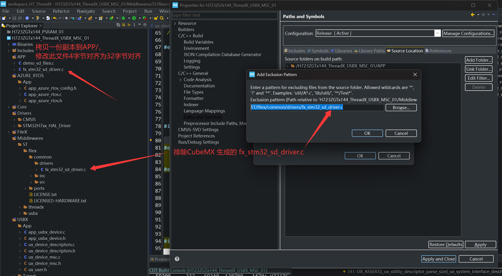
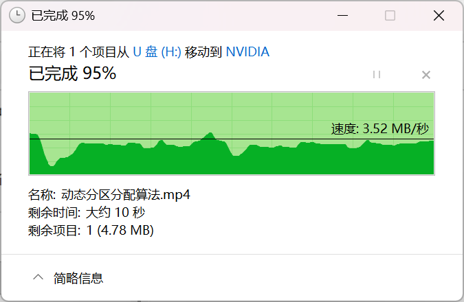
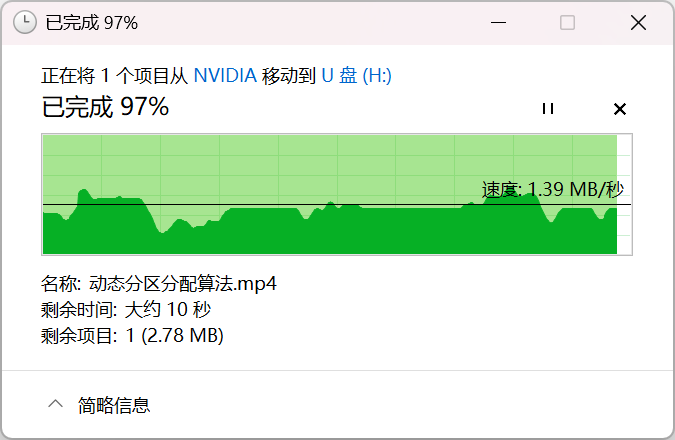
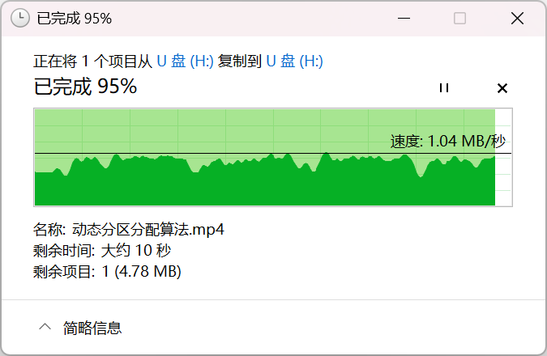
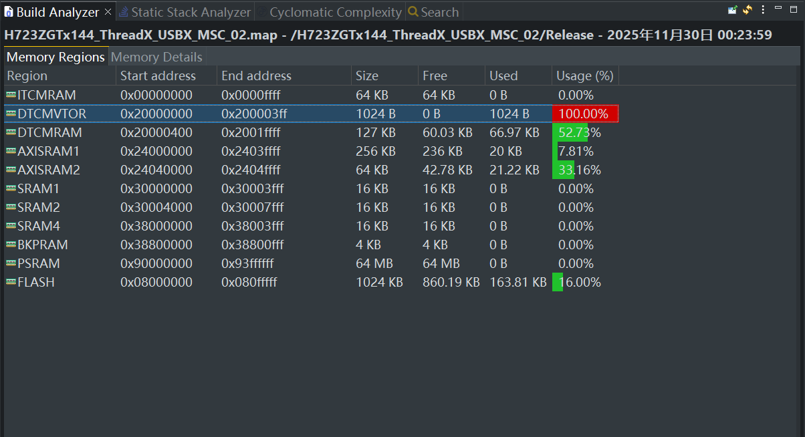
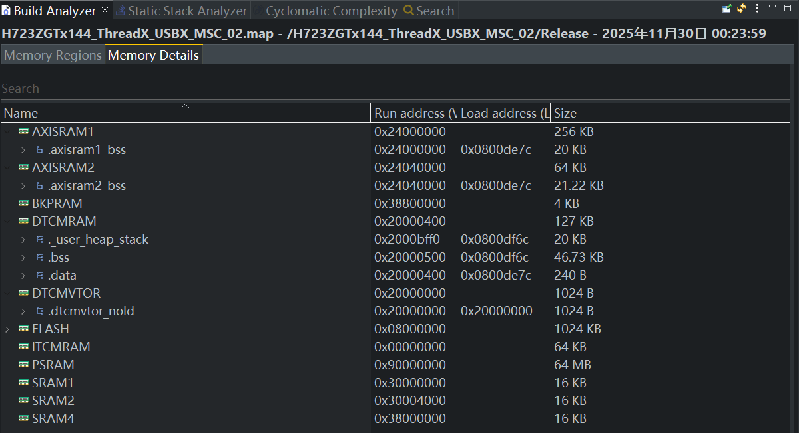

## H723ZGTx144_ThreadX_USBX_MSC_02

## 关于

在 H723ZGTx144_ThreadX_USBX_MSC_01 基础上将主内存从 AXISRAM 切换为 DTCM，

使用 attribute 将放在DTCM中导致不能正常工作的变量放到 .axisram2_bss和 .axisram2_data，MPU不开cache和buffer

已经修改 .ld 链接脚本文件和 .s启动文件

main函数中已经复制中断向量表到DTCM

## 配置

### 需要魔改： .ld 链接脚本 和 .s启动文件

本工程链接脚本使用：H723ZGTx144_ThreadX_USBX_MSC_02.ld

本工程启动文件使用：\APP\startup_stm32h723zgtx.s，需要在项目中排除原本的 \Core\Startup\\startup_stm32h723zgtx.s

（详细修改见文件源码，这里不解说）

### USBX：不可开读cache和写cache的变量

参考：[STM32H735G-DK/Applications/USBX/Ux_Device_MSC](https://github.com/STMicroelectronics/x-cube-azrtos-h7/tree/main/Projects/STM32H735G-DK/Applications/USBX/Ux_Device_MSC)

> #### **USBX 使用提示**
>
> - 如果启用了 USB DMA，则应用程序不应使用 DTCM (0x20000000) 内存区域。
> - 应确保将 **USB 内存池**区域配置为“**不可缓存**（Non-Cacheable）”属性，以确保 CPU 和 USB DMA 之间的一致性。

MPU配置参考：[STM32H7视频教程第14期：超干货，MPU和Cache实战，一张图了解所有经典配置案例...](https://www.cnblogs.com/armfly/p/16245867.html)

我将AXISRAM占用了ITCM共享区设为320K，然后在 .ld 链接脚本中，划分为 AXISRAM1 和 AXISRAM2

> .axisram1 是NORMAL最强性能模式，读 Cache 开启、写 Cache 开启
>
> ```c
>MPU_InitStruct.Enable = MPU_REGION_ENABLE;
> MPU_InitStruct.Number = MPU_REGION_NUMBER0;
>   MPU_InitStruct.BaseAddress = 0x24000000;
>   MPU_InitStruct.Size = MPU_REGION_SIZE_256KB;
>   MPU_InitStruct.SubRegionDisable = 0;
>   MPU_InitStruct.TypeExtField = MPU_TEX_LEVEL1;
>   MPU_InitStruct.AccessPermission = MPU_REGION_FULL_ACCESS;
>   MPU_InitStruct.DisableExec = MPU_INSTRUCTION_ACCESS_ENABLE;
>   MPU_InitStruct.IsShareable = MPU_ACCESS_NOT_SHAREABLE;
>   MPU_InitStruct.IsCacheable = MPU_ACCESS_CACHEABLE;
>   MPU_InitStruct.IsBufferable = MPU_ACCESS_BUFFERABLE;
>   ```
>   
> .axisram2 是NORMAL最低性能模式，读 Cache 关闭、写 Cache 关闭
>
> ```c
>MPU_InitStruct.Enable = MPU_REGION_ENABLE;
> MPU_InitStruct.Number = MPU_REGION_NUMBER5;
>   MPU_InitStruct.BaseAddress = 0x24040000;
>   MPU_InitStruct.Size = MPU_REGION_SIZE_64KB;
>   MPU_InitStruct.SubRegionDisable = 0;
>   MPU_InitStruct.TypeExtField = MPU_TEX_LEVEL1;
>   MPU_InitStruct.AccessPermission = MPU_REGION_FULL_ACCESS;
>   MPU_InitStruct.DisableExec = MPU_INSTRUCTION_ACCESS_ENABLE;
>   MPU_InitStruct.IsShareable = MPU_ACCESS_NOT_SHAREABLE;
>   MPU_InitStruct.IsCacheable = MPU_ACCESS_NOT_CACHEABLE;
>   MPU_InitStruct.IsBufferable = MPU_ACCESS_NOT_BUFFERABLE;
>   ```
>   

USBX 引入了以下变量：

#### 不能开启读写 Cache 

以下变量使用排除法一一测试过，放在 axisram1 中不正常，放在 axisram2 中正常

usb_otg.c：\Core\Src\usb_otg.c

- **hpcd_USB_OTG_HS**：大小1.22KB

app_azure_rtos.c：\APP\app_azure_rtos.c

- **ux_device_byte_pool_buffer**：usbx字节池，大小取决于配置

#### 可以开启读写 Cache 

以下变量使用排除法一一测试过，放在 dtcm、axisram1、axisram2 都正常

app_azure_rtos.c：\APP\app_azure_rtos.c

- **tx_byte_pool_buffer**：threadx字节池，大小取决于配置
- **fx_byte_pool_buffer**：filex字节池，大小取决于配置

app_filex.c：\FileX\App\app_filex.c

- **fx_sd_media_memory**：512B
- **sdio_disk**：大小取决于配置

> （以下变量内存空间总开销1485B）

ux_device_stack_initialize.c：\ST\usbx\common\core\src\ux_device_stack_initialize.c

- 所有 **\_ux_system_slave_class_storage_** 开头的数组：23B（用到数组合计大小）

ux_system_initialize.c：\ST\usbx\common\core\src\ux_system_initialize.c

- 所有 **\_ux_system_** 开头的数组：64B（用到数组合计大小）

ux_device_class_storage_initialize.c：\ST\usbx\common\usbx_device_classes\src\ux_device_class_storage_initialize.c

- 所有 **\_ux_system_slave_class_storage_** 开头的数组：52B（用到数组合计大小）

app_usbx_device.c：\USBX\App\app_usbx_device.c

- **storage_parameter**：84B

ux_device_descriptors.c：\USBX\App\ux_device_descriptors.c

- **USBD_Device_FS**：296B
- **USBD_Device_HS**：296B
- **UserClassInstance**：12B
- **DevFrameWorkDesc_FS**：200B
- **DevFrameWorkDesc_HS**：200B
- **USBD_string_framework**：256B
- **USBD_language_id_framework**：2B

### 需要修复的 BUG ：fx_stm32_sd_driver.c 字节对齐

#### 文字说明

在工程设置里排除 /ST/filex/common/drivers/fx_stm32_sd_driver.c

然后复制一份到 /APP 文件夹下，修改：

```c
  unaligned_buffer = (UINT)(media_ptr->fx_media_driver_buffer) & 0x1f; //!< 0x03 修改为 0x1f
```

#### 图片示意



#### 参考

[CSDN：修改方案（2024-04-24 17:11:17）](https://blog.csdn.net/qq_34446736/article/details/138162909?fromshare=blogdetail&sharetype=blogdetail&sharerId=138162909&sharerefer=PC&sharesource=weixin_44794918&sharefrom=from_link)

> SCB_InvalidateDCache_by_Addr() 要求传入的地址为32字节对齐，因为Cortex-M7内核的Cache line大小为8个字。
>
> 当传入的地址为4字节对齐非32字节对齐时，SCB_InvalidateDCache_by_Addr()调用传入的参数不符合要求，D-Cache缓存清除错误，使CPU读取到缓存中错误的值。

[ST：论坛报错（2025年11月21日 上午4:38）](https://community.st.com/t5/stm32-mcus-embedded-software/bug-in-fx-stm32-sd-driver-c/td-p/858270)

> **Bug in fx_stm32_sd_driver.c**
>
> 我认为我在上述文件中发现了一个错误（就我而言，该文件来自 x-cube_azrtos-h7，但其他版本似乎也存在此问题）。
> 在函数 fx_stm32_sd_driver() 中，会检查传入的数据缓冲区（media_ptr→fx_media_driver_buffer）是否为 4 字节对齐。如果是，则函数 sd_read_data() 直接使用传入的缓冲区；否则，使用本地暂存缓冲区。但是，DMA 操作完成后，该函数需要使缓存失效（通过调用 invalidate_cache_by_addr），而 Cortex M7 的缓存行是 32 字节。
> 这可能会导致缓冲区之外的缓存数据被覆盖。
>
> 更正：
>
> 仅当 fx_media_driver_buffer 为 32 字节对齐且为 32 字节的倍数时，才将 use_scratch_buffer 设置为 false。

## 一些思考

### ThreadX 全部使用静态内存

帖子：[关于threadx 的 内存申请疑惑：7#](https://forum.anfulai.cn/forum.php?mod=redirect&goto=findpost&ptid=126777&pid=324023&fromuid=47676)

### 在 Threadx 内核开启并正常运行后，才进行大部分系统外设的初始化

帖子：[关于threadx 的 内存申请疑惑：3#](https://forum.anfulai.cn/forum.php?mod=redirect&goto=findpost&ptid=126777&pid=323824&fromuid=47676)

硬汉：

> 正确的姿势就是这样的，我们新作的例子全部采用这种思路了。可以方便排查OS本身的启动问题和底层驱动的初始化问题。都放在main函数里面排查不方便
>
> main函数里面什么外设初始化都不做，仅仅是初始化HAL库和系统时钟并创建启动任务。
>
> 进入启动任务后，初始化各种外设并创建各种通信组件，并且这个启动任务不会被删除，继续作为一个启动任务使用

main函数仅初始化 HAL / 时钟，启动任务初始化外设 / 组件之后这个任务一直休眠，其内存不释放，是 ThreadX 的最佳实践

### ux_device_msc.c 中的 HAL SD DMA 读写函数不需要调用缓存维护API

USBD_STORAGE_Read() 和 USBD_STORAGE_Write() 函数不需要缓存维护API，HAL SD DMA 读写函数访问的是 AXISRAM2 区域

```c
UINT USBD_STORAGE_Read(VOID *storage_instance, ULONG lun, UCHAR *data_pointer,
                       ULONG number_blocks, ULONG lba, ULONG *media_status)
{
  UINT status = UX_SUCCESS;

  /* USER CODE BEGIN USBD_STORAGE_Read */
  UX_PARAMETER_NOT_USED(storage_instance);
  UX_PARAMETER_NOT_USED(lun);
  UX_PARAMETER_NOT_USED(media_status);

  ULONG ReadFlags = 0U;

  /* Check if the SD card is present */
//  if (HAL_GPIO_ReadPin(GPIOF, GPIO_PIN_5) != GPIO_PIN_RESET)
//  {
    /* Check id SD card is ready */
    if(check_sd_status() != HAL_OK)
    {
      _Error_Handler(__FILE__, __LINE__);
    }

    /* Start the Dma write */
    status =  HAL_SD_ReadBlocks_DMA(&hsd2, data_pointer, lba, number_blocks);
    if(status != HAL_OK)
    {
      _Error_Handler(__FILE__, __LINE__);
    }

// 不需要缓存维护API，访问的是AXISRAM2区域
//#if (FX_STM32_SD_CACHE_MAINTENANCE == 1)
//    invalidate_cache_by_addr((uint32_t*)data_pointer, number_blocks * FX_STM32_SD_DEFAULT_SECTOR_SIZE);
//#endif

    /* Wait on readflag until SD card is ready to use for new operation */
    if (tx_event_flags_get(&EventFlag, SD_READ_FLAG, TX_OR_CLEAR,
                           &ReadFlags, TX_WAIT_FOREVER) != TX_SUCCESS)
    {
      _Error_Handler(__FILE__, __LINE__);
    }
//  }

  /* USER CODE END USBD_STORAGE_Read */

  return status;
}

UINT USBD_STORAGE_Write(VOID *storage_instance, ULONG lun, UCHAR *data_pointer,
                        ULONG number_blocks, ULONG lba, ULONG *media_status)
{
  UINT status = UX_SUCCESS;

  /* USER CODE BEGIN USBD_STORAGE_Write */
  UX_PARAMETER_NOT_USED(storage_instance);
  UX_PARAMETER_NOT_USED(lun);
  UX_PARAMETER_NOT_USED(media_status);

  ULONG WriteFlags = 0U;

  /* Check if the SD card is present */
//  if (HAL_GPIO_ReadPin(GPIOF, GPIO_PIN_5) != GPIO_PIN_RESET)
//  {
    /* Check if SD card is ready */
    if(check_sd_status() != HAL_OK)
    {
      _Error_Handler(__FILE__, __LINE__);
    }

// 不需要缓存维护API，访问的是AXISRAM2区域
//#if (FX_STM32_SD_CACHE_MAINTENANCE == 1)
//    clean_cache_by_addr((uint32_t*)data_pointer, number_blocks * FX_STM32_SD_DEFAULT_SECTOR_SIZE);
//#endif

    /* Start the Dma write */
    status = HAL_SD_WriteBlocks_DMA(&hsd2, data_pointer, lba, number_blocks);

    if(status != HAL_OK)
    {
      _Error_Handler(__FILE__, __LINE__);
    }

    /* Wait on writeflag until SD card is ready to use for new operation */
    if (tx_event_flags_get(&EventFlag, SD_WRITE_FLAG, TX_OR_CLEAR,
                           &WriteFlags, TX_WAIT_FOREVER) != TX_SUCCESS)
    {
      _Error_Handler(__FILE__, __LINE__);
    }
//  }

  /* USER CODE END USBD_STORAGE_Write */

  return status;
}
```

## Demo

H723ZGTx144_ThreadX_USBX_MSC_01 有的测试都正常，感觉读写速度没有任何提升

|  |  |
| ------------------------------------------------------------ | ------------------------------------------------------------ |
| U盘剪切文件到电脑                                            | 电脑剪切文件到U盘                                            |
|  |                                                              |
| U盘拷贝文件到U盘                                             |                                                              |

## 内存分析器

|  |  |
| ------------------------------------------------------------ | ------------------------------------------------------------ |


