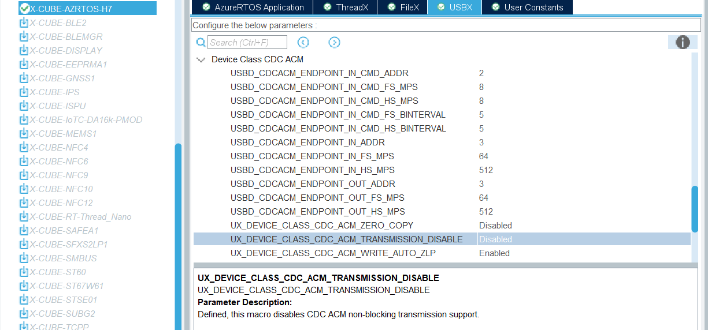
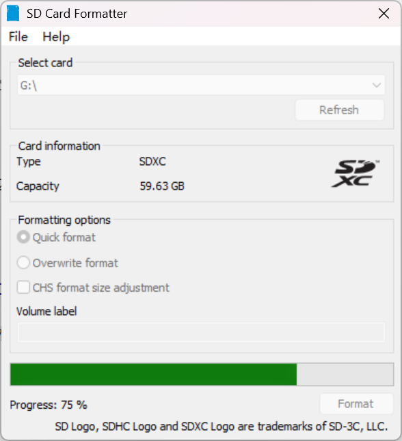
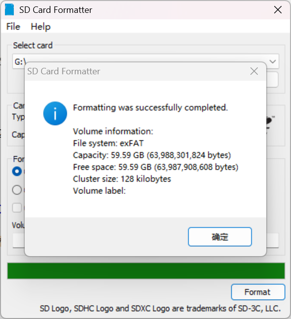
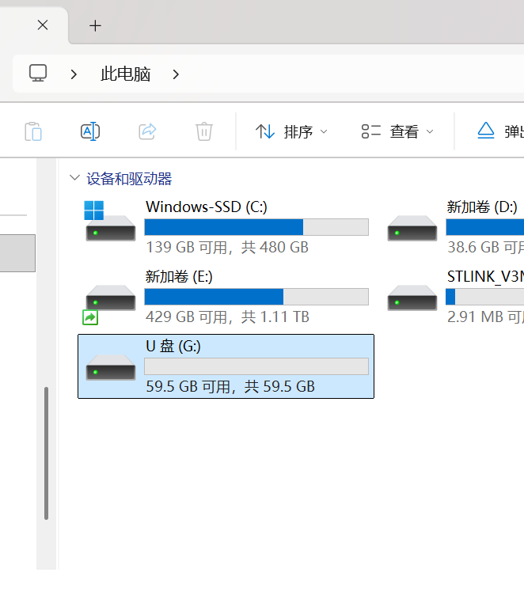
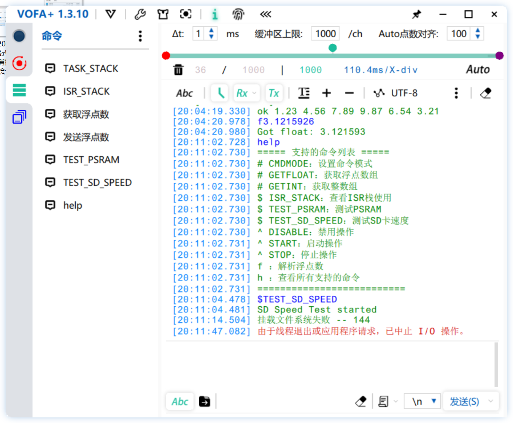
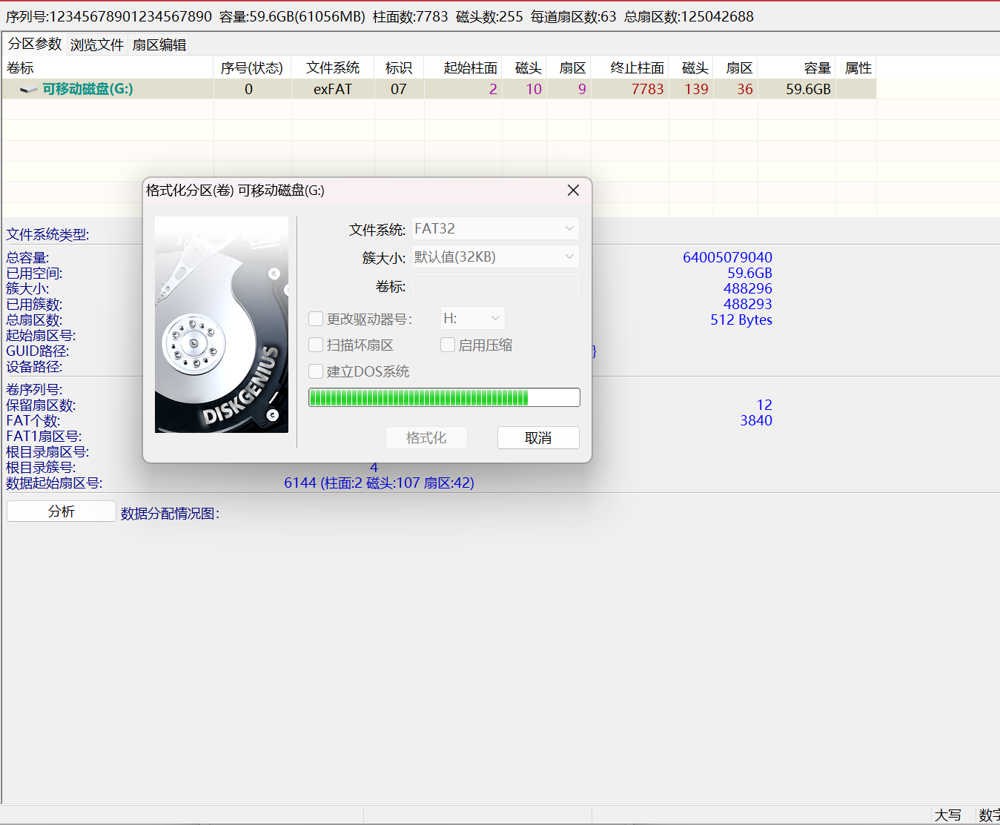
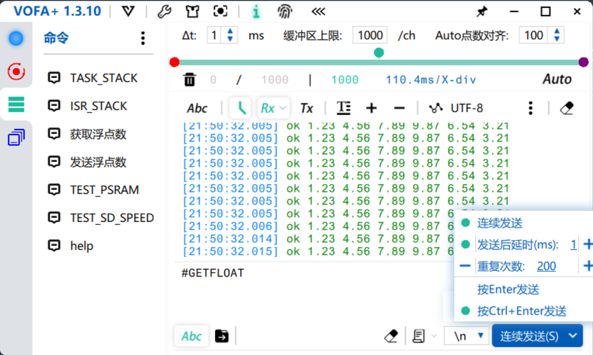
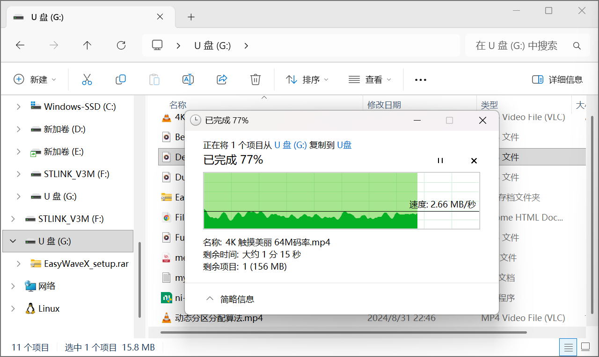
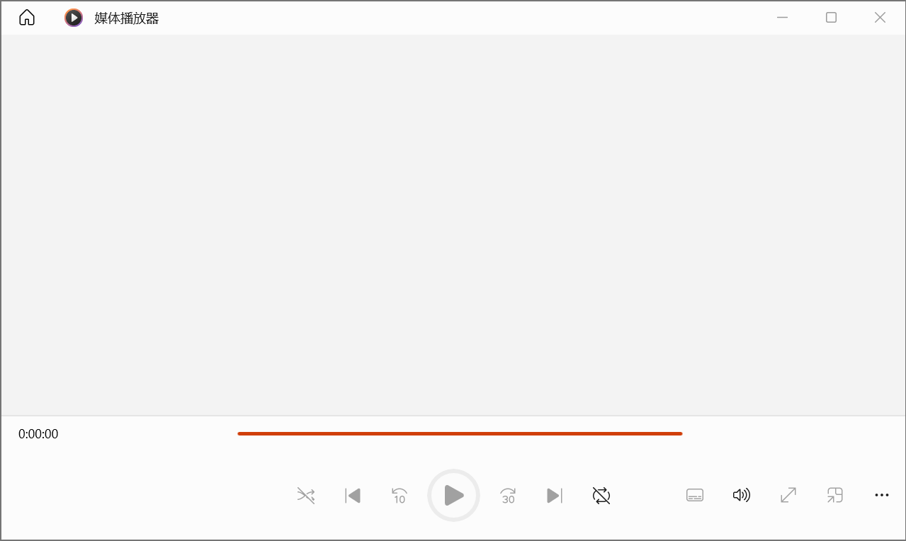
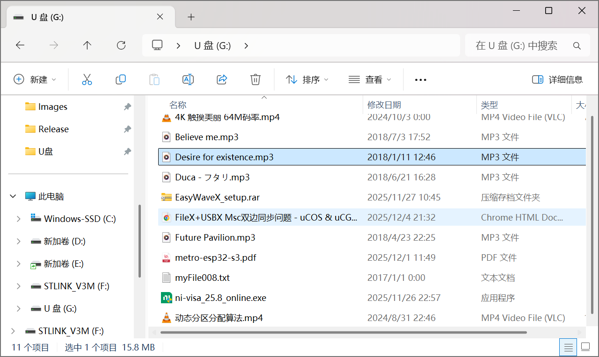

## H723ZGTx144_ThreadX_USBX_MSC_CDC_01

在 H723ZGTx144_ThreadX_USBX_MSC_02 的基础上修改，加入 CDC ACM 类，与 MSC 实现 USBX 复合设备，并重定向标准输入输出流到 USB CDC

重写 _write() 函数，通过 USBX CDC ACM 发送数据，配合 USBX CDC ACM 内部线程 _ux_device_class_cdc_acm_bulkin_thread，为写请求阻塞 

> `_ux_device_class_cdc_acm_bulkin_thread`是 USBX CDC ACM 的**专用写线程**，处理流程是：
>
> 1. 应用调用 ·_ux_device_class_cdc_acm_write_with_callback·
>    - 设置`cdc_acm->ux_slave_class_cdc_acm_scheduled_write = UX_TRUE`；
>    - 向线程发送`UX_DEVICE_CLASS_CDC_ACM_WRITE_EVENT`事件。
> 2. 线程等待到事件后，处理数据发送；
> 3. 发送完成后，**重置标志**`cdc_acm->ux_slave_class_cdc_acm_scheduled_write = UX_FALSE`；
> 4. 最后调用回调函数`ux_device_class_cdc_acm_write_callback`（即你的`USBD_CDC_ACM_Write_Callback`）。
>
> 应用层`ascii_protocol.cpp`响应电脑下方的命令后，以连续`Respond()`发送字符串给电脑，这写`Respond()`是**同步调用**的，因此必须让`_write`函数**阻塞到当前请求的线程处理完成（直到标志重置）**，再返回，这样后续请求才会在 “标志为`UX_FALSE`” 的状态下发起。那么`_write`就必须为**严格同步阻塞模式**，确保前一个请求的线程处理完成后，再发起下一个请求。

重写 _read() 函数，通过 USBX CDC ACM 获取数据，使用环形缓冲区，优势是 “缓存连续数据 + 支持按需拆包”，适配命令解析需求（按特定字符开头、提取参数、字符串查找），`OnAsciiCmd()`实现命令解析功能，**按 “命令结束符（\r\n）” 拆包**。

实测 VOFA+ 以 1ms下发200条命令可以一一解析并发回响应字符串

本工程测试的SD卡是三星64G EVO，若需要使用测度函数，则SD卡需要格式化为 FAT32，使用DiskGenius 默认FAT32 格式化就行

对于电脑端，不论使用 SD Card Formatter 格式化为 exFat，或者DiskGenius 默认FAT32 格式化，都可以识别SD卡并正常读写文件

## CubeMX：USBX配置

### 端点号

参考：[ThreadX+USBX HID CDC复合设备失败](https://forum.anfulai.cn/forum.php?mod=viewthread&tid=106191)

> 我的找到原因了。。垃圾CubeMX生成的程序有问题。
>
> USBD_CDCACM_EPINCMD_ADDR生成的是0x81，与USBD_CDCACM_EPIN_ADDR一样了
> 跟提供的教程比较了一下，发现这个值应该是0x82，改完就好了

在CubeMX配置MSC的IN和OUT端点地址都是1，实际上生成的代码对应的宏： 

```c
/* Device Storage Class */
#define USBD_MSC_EPOUT_ADDR                           0x01U
#define USBD_MSC_EPIN_ADDR                            0x81U
```

CubeMX 界面中配置的 “端点 1” 是「端点号」，生成代码时会自动补充「方向位」，最终`0x01U`（OUT）和`0x81U`（IN）是**同一个端点号的双向批量端点**，符合 USB 协议，不存在冲突。

由于已经将MSC的端点号配置为1，所以需要修改新增复合设备的 CMD IN 端点、BULK IN 和 BULK OUT默认端点号1，否则会冲突

### 免驱端点号

参考：[RL-USB V6.X复合设备的端点号设置真是考究](https://forum.anfulai.cn/forum.php?mod=viewthread&tid=95861&highlight=%B6%CB%B5%E3)

> 使用免驱的HID和MSC，有些BULK IN，OUT以及中断**端点**的配置就可以用，而有些就不行。
>
> 真是邪门，看来这个东西的设计还比较讲究，后面再研究下

参考：[usb复合设备可以复用同一个控制端点吗？](https://forum.anfulai.cn/forum.php?mod=viewthread&tid=123399&highlight=%B6%CB%B5%E3)

### 端点FIFO大小设置

参考：[STM32H7 USB的4KB专用FIFO的分配问题](https://forum.anfulai.cn/forum.php?mod=viewthread&tid=103438&highlight=USB%2BFIFO)

> RL-USB里面有一个：
>
> ```c
> #ifndef USBD_FS_MAX_ENDPOINT_NUM
> #define USBD_FS_MAX_ENDPOINT_NUM   (8U)
> #endif
> #if    (USBD_FS_MAX_ENDPOINT_NUM > 8U)
> #error  Too many Endpoints, maximum IN/OUT Endpoint pairs that this driver supports is 8 !!!
> #endif
> 
> // FIFO sizes in bytes (total available memory for FIFOs is 4 kB)
> #ifndef OTG_FS_RX_FIFO_SIZE
> #define OTG_FS_RX_FIFO_SIZE        (1024U)
> #endif
> #ifndef OTG_FS_TX0_FIFO_SIZE
> #define OTG_FS_TX0_FIFO_SIZE       (64U)
> #endif
> #ifndef OTG_FS_TX1_FIFO_SIZE
> #define OTG_FS_TX1_FIFO_SIZE       (1024U)
> #endif
> #ifndef OTG_FS_TX2_FIFO_SIZE
> #define OTG_FS_TX2_FIFO_SIZE       (512U)
> #endif
> #ifndef OTG_FS_TX3_FIFO_SIZE
> #define OTG_FS_TX3_FIFO_SIZE       (256U)
> #endif
> #ifndef OTG_FS_TX4_FIFO_SIZE
> #define OTG_FS_TX4_FIFO_SIZE       (256U)
> #endif
> #ifndef OTG_FS_TX5_FIFO_SIZE
> #define OTG_FS_TX5_FIFO_SIZE       (256U)
> #endif
> #ifndef OTG_FS_TX6_FIFO_SIZE
> #define OTG_FS_TX6_FIFO_SIZE       (256U)
> #endif
> #ifndef OTG_FS_TX7_FIFO_SIZE
> #define OTG_FS_TX7_FIFO_SIZE       (256U)
> #endif
> #ifndef OTG_FS_TX8_FIFO_SIZE
> #define OTG_FS_TX8_FIFO_SIZE       (192U)
> ```

参考：[ST：在STM32上以设备模式管理USB OTG控制器中FIFO的实际应用案例](https://community.st.com/t5/stm32-mcus/practical-use-cases-to-manage-fifo-in-usb-otg-controllers-in/ta-p/839963)

参考：[ThreadX USB组合设备端点缓存设置问题](https://forum.anfulai.cn/forum.php?mod=viewthread&tid=123050&highlight=%B6%CB%B5%E3)

> 单独读写MSC没问题。用的fx_media_write实现的。MSC读写的时候，CDC不正常。
>
> MSC读写的时候，不对CDC和HID操作，等MSC读写完成后，CDC收发正常，但HID就不行了
>
> [此贴作者还在另一个帖子分享了此BUG工程](https://forum.anfulai.cn/forum.php?mod=viewthread&tid=111611&highlight=HID)
>
> MSC+CDC+HID，CDC和HID可以同时各自做回环测试，同时MSC也可以读，但是MSC只要一写，CDC和HID就会报错，如果写MSC时，不对CDC和HID进行操作，等MSC写完后，再打开CDC做回环测试没问题，HID也能打开，但只能从设备往电脑发送，电脑不能往设备发送。
>
> - [U5A9J_MSC.zip](https://forum.anfulai.cn/forum.php?mod=attachment&aid=OTI0NjJ8NjYwZDY4NTJ8MTc2NDQ0NDA2OHw0NzY3NnwxMTE2MTE%3D)11.13 MB, 下载次数: 29

### HID 复合设备收发通信

> [usbx hid Bus Hound不能发送数据](https://forum.anfulai.cn/forum.php?mod=viewthread&tid=110051&highlight=HID)
>
> 15 个回复 - 4765 次查看
>
> STM32H7，根据en.x-cube-azrtos-h7例程，移植了一个USBX。 复合设备，一个CDC ACM，一个**HID**。 CDC ACM能正常收发。 **HID**能发，但不能收。用BUS HOUND向开发板发送数据，提示invalid command，然后没有任何反应
>
> [求助USBX有人用Custom HID实现了收发通信功能的吗？](https://forum.anfulai.cn/forum.php?mod=viewthread&tid=120887&highlight=HID)
>
> > 他的问题已经解决了。
> >
> > stm32u5开发板 usbx调试
> > [https://forum.anfulai.cn/forum.p ... 1214&fromuid=58](https://forum.anfulai.cn/forum.php?mod=viewthread&tid=121214&fromuid=58)
> >
> > > [**stm32u5开发板 usbx调试** ](https://forum.anfulai.cn/forum.php?mod=viewthread&tid=121214&fromuid=58)
> > >
> > > 已经遇到如下问题：
> > >
> > > \1. 初始化完成后，可正常枚举设备信息，也可正常上报数据，但是第二帧上报的数据如果超过5s，就进入suspend模式，无法唤醒
> > >
> > >   --因为项目还需要用到CDC-ACM，使能CDC-ACM模块后，该问题解决，应该是CDC一直在工作，不会让总线休眠；
> > >
> > > \2. host(PC)通过bus Hound可以向device发送数据，但是只能发送一帧，第二次再发送bus Hound底部显示running，无法complete，一定时间后，device就停止工作了
> > >
> > > 硬汉：
> > >
> > > 1、Host向Device一次发送多少字节。
> > > 2、注意端点FIFO大小配置，这个非常重要。
> > > 2、运行模拟鼠标或键盘的例子是否正常，实在不行，可以用这个例子修改描述为自定义HID类测试。
> > >
> > > > \1. Host向Device双向的通信字节配置都是64字节，端点1
> > > > \2. HAL_PCDEx_SetRxFiFo(&hpcd_USB_OTG_FS, 0x0200);
> > > >   HAL_PCDEx_SetTxFiFo(&hpcd_USB_OTG_FS, 0, 0x40);
> > > >   HAL_PCDEx_SetTxFiFo(&hpcd_USB_OTG_FS, 1, 0x40);
> > > > \3. 鼠标的例子运行过了，配置的就是Custom HID类，然后将report描述符使用鼠标的，可以正常控制鼠标，并且发送间隔不会使总线休眠；目前report的描述符是复用的我们之前项目的描述符，一个input一个output。
> > > > 我也对比过我这个工程，以及单纯的鼠标demo，有差异的地方主要就是描述符的部分。其他的接口几乎一样
> > >
> > > 
> > >
> > > 刚调试中找到部分原因了
> > >
> > > ```c
> > > /**
> > >  \* @brief USBD_Custom_HID_SetReport
> > >  \*      This function is invoked when the host sends a HID SET_REPORT
> > >  \*      to the application over Endpoint OUT (Set Report).
> > >  \* @param hid_instance: Pointer to the hid class instance.
> > >  \* @retval none
> > >  */
> > > VOID USBD_Custom_HID_SetReport(struct UX_SLAVE_CLASS_HID_STRUCT *hid_instance)
> > > {
> > >  /* USER CODE BEGIN USBD_Custom_HID_SetReport */  
> > >   
> > >   ux_device_class_hid_receiver_event_get(hid_instance, &usb_hid_event_rec);
> > >   memcpy(hid_receive_buff, usb_hid_event_rec.ux_device_class_hid_received_event_data,
> > >        usb_hid_event_rec.ux_device_class_hid_received_event_length);
> > >   
> > >   ux_device_class_hid_receiver_event_free(hid_instance);
> > >  /* USER CODE END USBD_Custom_HID_SetReport */
> > > 
> > >  return;
> > > }
> > > ```
> > >
> > > 在这个接收的callback函数中，接收完一次数据，需要将slave的hid事件释放，才能进入到下一次的传输。
> > >
> > > 但是又有新问题出现，传输10次后，就又是这样了，一直卡在running的状态，估计和FIFO相关了。一步一个坎呀
> > >
> > > 确实是fifo配置影响的
> > >
> > > ```c
> > >  HAL_PCDEx_SetRxFiFo(&hpcd_USB_OTG_FS, 0x80);
> > >  HAL_PCDEx_SetTxFiFo(&hpcd_USB_OTG_FS, 0, 0x40);
> > >  HAL_PCDEx_SetTxFiFo(&hpcd_USB_OTG_FS, 1, 0x40);
> > > ```
> > >
> > > 使用这样的配置，目前测试数据接收和发送，就没有问题了。
> > >
> > > ST Custom HID 示例：https://github.com/STMicroelectronics/stm32-usbx-examples/blob/main/Projects/STM32H743I-EVAL/Applications/USBX/Ux_Device_CustomHID/USBX/App/ux_device_customhid.c

### C# HID通信上位机

> [想用c#写一个usbhid的上位机，有没有可以参考的demo？](https://forum.anfulai.cn/forum.php?mod=viewthread&tid=111944&highlight=HID)
>
> > github上随便搜都有一堆
> > https://github.com/jcoenraadts/hid-sharp
> > https://github.com/mikeobrien/HidLibrary

### 配置值

- UX_STANDALONE：不定义，以运行在 RTOS 模式

  > 是否使能整个USBX框架独立使用模式

- UX_DEVICE_STANDALONE：不定义，以运行在 RTOS 模式

  > 是否使能 USB Device独立使用模式，不影响 USB Host 的模式

- UX_MAX_SLAVE_CLASS_DRIVER：2（等于复合设备数量）

  > 此项配置不正确会导致的问题：
  >
  > 在MX_USBX_Device_Init() 内部调用第二个USB CDC类注册，即
  >
  > ```
  > ux_device_stack_class_register(_ux_system_slave_class_cdc_acm_name,
  >           ux_device_class_cdc_acm_entry,
  >           cdc_acm_configuration_number,
  >           cdc_acm_interface_number,
  >           &cdc_acm_parameter);
  > ```
  >
  > 一直返回 UX_MEMORY_INSUFFICIENT，字面意思是内存不足，尝试加大 USBX_DEVICE_MEMORY_STACK_SIZE 到 50KB，UX_DEVICE_APP_MEM_POOL_SIZE 到 100KB 都没能解决，原因是 ux_device_stack_class_register()会检查 UX_MAX_SLAVE_CLASS_DRIVER  宏是否为 1，如果是 1就返回  UX_MEMORY_INSUFFICIENT
  >
  > 本工程需要在MSC类之后注册一个CDC类实现复合设备，而 CubeMX 里 UX_MAX_SLAVE_CLASS_DRIVER  还是默认值 1，需要改为 2 解决

- USBD_CDCACM_ENDPOINT_IN_CMD_ADDR：2（IN CMD 端点号）

- USBD_CDCACM_ENDPOINT_IN_CMD_FS_MPS：8

- USBD_CDCACM_ENDPOINT_IN_CMD_HS_MPS：8

  > [来源：豆包](https://www.doubao.com/thread/w486e4506a16a90ff)
  >
  > MPS（最大包大小）只需**能容纳该端点的最大传输数据量**即可，无需配到上限：
  >
  > - **全速（FS）**：中断端点的 MPS 最大为 64 字节，但命令中断端点的实际数据仅 1~2 字节；
  > - **高速（HS）**：中断端点的 MPS 最大也为 64 字节（高速 USB 的中断端点 MPS 上限仍为 64），实际数据量与全速一致。
  >
  > 推荐配置：
  >
  > - 8 字节（行业标准值）
  >
  > 避坑说明
  >
  > - 无需配到上限（64 字节）：命令中断端点的数据量固定很小，配 64 字节只会浪费 USB 总线的端点带宽（无实际收益）；
  > - FS 和 HS 可统一配置为 8：两者传输的控制信号数据量完全一致，无需区分全速 / 高速单独调整。

- USBD_CDCACM_ENDPOINT_IN_CMD_FS_BINTERVAL：8

- USBD_CDCACM_ENDPOINT_IN_CMD_HS_BINTERVAL：8

  > [来源：豆包](https://www.doubao.com/thread/w5101946f32babe8b)
  >
  > 是 CDC ACM**命令中断 IN 端点**的「轮询间隔（bInterval）」，对应 USB 描述符中的`bInterval`字段，主机按照该间隔轮询设备的 CDC 命令中断端点，获取串口控制信号（如 DTR/RTS 状态、线状态变化等）
  >
  > 取值范围：1~255
  >
  > CDC ACM 命令中断端点的 bInterval 无需追求 “最快”，需平衡「响应速度」和「USB 总线负载」，以下是符合 USB 协议 + 实际工程的配置方案：
  >
  > | 场景                 | FS_BINTERVAL（全速） | HS_BINTERVAL（高速） | 说明                                                         |
  > | -------------------- | -------------------- | -------------------- | ------------------------------------------------------------ |
  > | 通用场景（推荐）     | 8                    | 8                    | FS=8ms 轮询，HS=1ms 轮询（1ms 是 CDC 控制信号的主流响应速度，总线负载低）； |
  > | 快速响应场景         | 1                    | 8                    | FS=1ms 轮询（最快），HS=1ms 轮询（与 FS 响应速度对齐）；     |
  > | 低总线负载场景       | 10~20                | 16                   | FS=10~20ms 轮询，HS=2ms 轮询（16×125μs），适合对控制信号响应无高要求的场景； |
  > | 极端低负载（不推荐） | ≤50                  | ≤16                  | FS 不建议超过 50ms（否则控制信号延迟明显）；HS 超过 16 无意义（USB 2.0 规范中 HS 中断端点 bInterval 实际有效范围仅 1~16，超过后主机仍按 16 微帧处理）； |
  >
  > HS 模式下，即使 CubeMX 允许设 1~255，**实际有效取值仅 1~16**（USB 2.0 协议规定），设为 17~255 时，主机仍会按 16 微帧（2ms）轮询

- USBD_CDCACM_ENDPOINT_IN_ADDR：3（IN BULK 端点号）

- USBD_CDCACM_ENDPOINT_IN_FS_MPS：64

- USBD_CDCACM_ENDPOINT_IN_HS_MPS：512

- USBD_CDCACM_ENDPOINT_OUT_ADDR：3（OUT BULK 端点号）

- USBD_CDCACM_ENDPOINT_OUT_FS_MPS：64

- USBD_CDCACM_ENDPOINT_OUT_HS_MPS：512

- UX_DEVICE_CLASS_CDC_ACM_ZERO_COPY：DISABLED

  > 零拷贝保持默认暂不开启，待研究

- UX_DEVICE_CLASS_CDC_ACM_TRANSMISSION_DISABLE：ENABLED

- UX_DEVICE_CLASS_CDC_ACM_WRITE_AUTO_ZLP：ENABLED

[分享基于安富莱ThreadX全家桶2.0版本实现的USBX CDC ACM+PPP连接服务](https://forum.anfulai.cn/forum.php?mod=viewthread&tid=123737)

## 参考

### 例程 Ux_Device_CDC_ACM

ST的USBX设备例程：CDC_ACM 转 UART 桥

[x-cube-azrtos-h7-main\x-cube-azrtos-h7-main\Projects\NUCLEO-H723ZG\Applications\USBX\Ux_Device_CDC_ACM](https://github.com/STMicroelectronics/x-cube-azrtos-h7/tree/main/Projects/NUCLEO-H723ZG/Applications/USBX/Ux_Device_CDC_ACM)

此例程**实现 USB CDC ACM 转 USART 桥**，使用了事件标志组 EventFlag 与 H723ZGTx144_ThreadX_USBX_MSC_02 工程 MSC 使用的事件标志组同名，COPY代码时需要区分！

### 例程 Ux_Device_HID_CDC_ACM

ST的USBX复合设备例程：HID 模拟鼠标设备 + CDC_ACM 转 UART 桥

[x-cube-azrtos-h7-main\x-cube-azrtos-h7-main\Projects\STM32H747I-DISCO\Applications\USBX\Ux_Device_HID_CDC_ACM](https://github.com/STMicroelectronics/x-cube-azrtos-h7/tree/main/Projects/STM32H747I-DISCO/Applications/USBX/Ux_Device_HID_CDC_ACM)

> 系统会定期在 usbx_cdc_acm_write_thread_entry 中检查缓冲区“UserTxBufferFS”的状态。如果有可用数据，则会响应输入 (IN) 请求发送数据；否则，该缓冲区将被标记为 NAK

PS：还有一个 H735 的主机HID和CDC_ACM复合例程 Ux_Host_HID_CDC_ACM，以后要是用得上可以看看

## printf / scanf 线程安全问题

### 方案一：在 printf 外面封装一个 App_Printf 加互斥锁（不推荐）

例程 V7-2401_ThreadX USBX Template

[安富莱 STM32-V7 开发板 ThreadX USBX 教程,pdf](https://forum.anfulai.cn/forum.php?mod=viewthread&tid=108546)

App_Printf 函数做了信号量的互斥操作，解决资源共享问题

main.c

```c
/**
 * @brief 用于 printf 打印的互斥锁（线程安全打印）
 */
static TX_MUTEX AppPrintfSemp;

/**
 * @brief 创建任务通讯相关的内核对象
 * @details 初始化 printf 打印所需的互斥锁，保证多线程打印不混乱
 * @return 无
 */
static void AppObjCreate(void)
{
    /* 创建 printf 互斥锁：不启用优先级继承 */
    tx_mutex_create(&AppPrintfSemp, "AppPrintfSemp", TX_NO_INHERIT);
}

/**
 * @brief 线程安全的 printf 封装函数
 * @details 基于 ThreadX 互斥锁实现多线程打印互斥，避免打印内容交织乱码；
 *          内部使用固定缓冲区，需注意打印内容长度不超过缓冲区上限
 * @param fmt 格式化输出字符串（同 printf 格式）
 * @param ... 可变参数列表（同 printf 可变参数）
 * @return 无
 */
static void App_Printf(const char *fmt, ...)
{
    /* 打印缓冲区：预留 1 字节用于字符串结束符，避免越界 */
    char buf_str[200 + 1];
    va_list v_args;

    /* 解析可变参数并格式化到缓冲区 */
    va_start(v_args, fmt);
    (void)vsnprintf(buf_str, sizeof(buf_str), fmt, v_args);
    va_end(v_args);

    /* 互斥锁保护：独占 printf 打印，防止多线程抢占 */
    tx_mutex_get(&AppPrintfSemp, TX_WAIT_FOREVER);
    printf("%s", buf_str);
    tx_mutex_put(&AppPrintfSemp);
}
```

增加缓冲区溢出检查的版本

```c

static void App_Printf(const char *fmt, ...)
{
    char buf_str[200 + 1];
    va_list v_args;
    int ret;

    va_start(v_args, fmt);
    ret = vsnprintf((char       *)&buf_str[0],
                    (size_t      ) sizeof(buf_str),
                    (char const *) fmt,
                                   v_args);
    va_end(v_args);

    /* 增加缓冲区溢出提示 */
    if (ret >= (int)sizeof(buf_str)) {
        /* 互斥printf */
        tx_mutex_get(&AppPrintfSemp, TX_WAIT_FOREVER);
        printf("[PRINTF WARN] Buffer overflow! Content truncated.\n");
        tx_mutex_put(&AppPrintfSemp);
    }
    /* 互斥 printf */
    tx_mutex_get(&AppPrintfSemp, TX_WAIT_FOREVER);
    printf("%s", buf_str);
    tx_mutex_put(&AppPrintfSemp);
}
```


### 方案二：在 _write / _read 中加互斥锁（最佳实践）

> PS：不推荐在更底层的 _gets / _puts 加互斥锁，效率太低

帖子：printf、fprintf、scanf 等函数在线程 X 中是否线程安全？

[2025年2月11日：printf、fprintf、scanf 等函数在线程 X 中是否线程安全？](https://community.st.com/t5/stm32-mcus-embedded-software/are-printf-fprintf-scanf-etc-threadsafe-in-threadx/td-p/771846)

> > [ABasi.2](https://community.st.com/t5/user/viewprofilepage/user-id/52099)
> >
> > 你好
> >
> > 我有一个关于 printf 函数的问题。还有 fprintf、scanf 等函数。
> >
> > 我正在将这些函数重定向到使用 UART，替换int _write(int file, char *ptr, int len) 和 int _read(int file, char *ptr, int len) 函数。
> >
> > ```c
> > int _write(int file, char *ptr, int len)
> > { 
> >   HAL_UART_Transmit(&huart2,(uint8_t*)ptr, len, 1000); 
> >   return len;
> > }
> > 
> > int _read(int file, char *ptr, int len)
> > {    
> >   __HAL_UART_CLEAR_OREFLAG(&huart2);
> >   HAL_UART_Receive(&huart2,(uint8_t*)ptr, len,HAL_MAX_DELAY);
> >   HAL_UART_Transmit(&huart2,(uint8_t*)ptr,len, 1000);  
> >   return len;
> > }
> > ```
> >
> > 现在我正在使用 threadX，并且可能会从多个线程调用 printf 或其他函数。
> >
> > 这种方法本身是否线程安全，还是我需要为UART实现互斥锁？
> >
> > 如果我必须使用互斥锁，是否可以在 _write 或 _read 函数内部获取并放置互斥锁，还是必须在调用 printf 函数之前获取互斥锁？
> >
> > 谢谢
>
> >  [Saket_Om](https://community.st.com/t5/user/viewprofilepage/user-id/1708) ST员工
> >
> > **已接受的解决方案**
> >
> > 为了确保线程安全，您需要使用互斥锁来保护 UART 访问。您可以在 `_write` 和 `_read` 函数内部实现互斥锁，也可以在调用 `printf` 或其他相关函数之前获取互斥锁。
>
> > [ABasi.2](https://community.st.com/t5/user/viewprofilepage/user-id/52099)
> >
> > 谢谢你！
> >
> > 我已将代码修改如下：
> >
> > ```c
> > int _write(int file, char *ptr, int len)
> > {     
> >   if(tx_mutex_get(&consoleMutex,TX_WAIT_FOREVER) == TX_SUCCESS)
> >   {
> >     HAL_UART_Transmit(&huart2,(uint8_t*)ptr, len, 1000);
> >     tx_mutex_put(&consoleMutex);
> >     return len;
> >   }
> >   return 0;  
> > }
> > ```
> >
> > 运行正常
> >
> > 致以最诚挚的问候

[豆包：在\_write/\_read中加互斥锁](https://www.doubao.com/thread/w6c1426625fc9471d)

>### 核心结论：**完全可以（且是更优方案）**
>
>在 `_write`/`_read` 中加互斥锁是 ThreadX 下实现 UART 底层线程安全的**最佳实践**——相比在上层 `App_Printf` 加锁，这种方式能让所有依赖 `_write`/`_read` 的标准库函数（`printf`/`fprintf`/`puts`/`scanf`/`gets` 等）都自动具备线程安全，无需逐个封装上层函数。
>
>
>### 一、为什么推荐在 `_write`/`_read` 中加锁？
>
>| 加锁方式                 | 优点                                                         | 缺点                                                         |
>| ------------------------ | ------------------------------------------------------------ | ------------------------------------------------------------ |
>| 底层（_write/_read）加锁 | 1. 覆盖所有标准IO函数（printf/scanf等）；<br>2. 代码简洁，无需封装上层函数；<br>3. 互斥逻辑集中，易维护 | 持有锁期间若UART操作阻塞，其他线程等待时间略长（可优化）     |
>| 上层（App_Printf）加锁   | 持有锁时间短（仅格式化字符串后打印）                         | 1. 仅覆盖封装后的函数，原生printf/scanf仍不安全；<br>2. 需逐个封装所有IO函数，代码冗余 |
>
>
>### 二、完整实现代码（ThreadX + STM32 HAL）
>
>#### 1. 头文件 & 全局互斥锁定义
>
>```c
>#include "tx_api.h"
>#include "stm32h7xx_hal.h"
>
>/* 声明UART句柄（需和你的工程一致，如huart1/huart2） */
>extern UART_HandleTypeDef huart2;
>
>/* 定义UART互斥锁（全局可见，供_write/_read使用） */
>static TX_MUTEX uart_mutex;
>```
>
>#### 2. 初始化互斥锁（必须在使用前创建！）
>
>在 `tx_application_define`（ThreadX 任务创建入口）中初始化互斥锁：
>
>```c
>void tx_application_define(void *first_unused_memory)
>{
>    UINT status;
>
>    /* 创建UART互斥锁：不启用优先级继承（简单场景足够） */
>    status = tx_mutex_create(&uart_mutex, "UART_Mutex", TX_NO_INHERIT);
>    if (status != TX_SUCCESS)
>    {
>        /* 初始化失败处理（如LED报错） */
>        while(1);
>    }
>
>    /* 后续：创建业务线程... */
>}
>```
>
>#### 3. 改造 `_write` 函数（输出printf/puts等）
>
>```c
>/* 重定向标准输出：printf/fprintf等最终调用此函数 */
>int _write(int file, char *ptr, int len)
>{
>    /* 仅处理标准输出/标准错误（避免其他文件描述符干扰） */
>    if (file != 1 && file != 2) 
>    {
>        errno = EBADF;
>        return -1;
>    }
>
>    /* 获取互斥锁（无限等待，确保必能获取） */
>    if (tx_mutex_get(&uart_mutex, TX_WAIT_FOREVER) == TX_SUCCESS)
>    {
>        /* 阻塞发送UART数据（超时1000ms，适配HAL库） */
>        HAL_UART_Transmit(&huart2, (uint8_t*)ptr, len, 1000);
>        
>        /* 释放互斥锁（必须！否则其他线程永久阻塞） */
>        tx_mutex_put(&uart_mutex);
>        return len;
>    }
>    
>    /* 锁获取失败（理论上不会走到，因TX_WAIT_FOREVER） */
>    errno = EIO;
>    return 0;
>}
>```
>
>#### 4. 改造 `_read` 函数（输入scanf/gets等）
>
>```c
>/* 重定向标准输入：scanf/gets等最终调用此函数 */
>int _read(int file, char *ptr, int len)
>{
>    /* 仅处理标准输入 */
>    if (file != 0) 
>    {
>        errno = EBADF;
>        return -1;
>    }
>
>    /* 获取互斥锁 */
>    if (tx_mutex_get(&uart_mutex, TX_WAIT_FOREVER) == TX_SUCCESS)
>    {
>        /* 清除UART溢出标志（避免接收异常） */
>        __HAL_UART_CLEAR_OREFLAG(&huart2);
>        
>        /* 阻塞接收数据（HAL_MAX_DELAY表示无限等待） */
>        HAL_UART_Receive(&huart2, (uint8_t*)ptr, len, HAL_MAX_DELAY);
>        
>        /* 回显（可选：输入的字符再发回串口，方便调试） */
>        HAL_UART_Transmit(&huart2, (uint8_t*)ptr, len, 1000);
>        
>        /* 释放互斥锁 */
>        tx_mutex_put(&uart_mutex);
>        return len;
>    }
>    
>    errno = EIO;
>    return 0;
>}
>```
>
>
>### 三、关键避坑注意事项
>
>#### 1. 死锁防范（重中之重）
>
>- **持有锁时避免耗时操作**：`HAL_UART_Transmit/Receive` 的超时不要设过大（如 `HAL_MAX_DELAY` 仅在 `_read` 中用），否则持有锁时间过长，其他线程阻塞严重；
>
>- **禁止中断中调用标准IO函数**：中断上下文不能调用 `tx_mutex_get`（ThreadX 互斥锁仅支持线程级调用），若中断需打印，改用“环形缓冲区 + 线程处理”：
>
>  ```c
>  // 示例：中断中写入缓冲区，线程中读取并打印
>  uint8_t uart_buf[128];
>  uint16_t buf_idx = 0;
>  void USART2_IRQHandler(void)
>  {
>      if (__HAL_UART_GET_FLAG(&huart2, UART_FLAG_RXNE) != RESET)
>      {
>          uart_buf[buf_idx++] = huart2.Instance->DR;
>          buf_idx %= 128; // 防止溢出
>          __HAL_UART_CLEAR_FLAG(&huart2, UART_FLAG_RXNE);
>      }
>  }
>  ```
>
>#### 2. 互斥锁初始化时机
>
>必须在**第一个线程调用 `printf`/`scanf` 前**创建互斥锁（推荐在 `tx_application_define` 中创建），否则 `tx_mutex_get` 会返回 `TX_ERROR`，导致UART操作无保护。
>
>#### 3. 优化 `_read` 的阻塞问题
>
>`HAL_UART_Receive(&huart2, ..., HAL_MAX_DELAY)` 会让线程永久阻塞，且持有互斥锁期间其他线程无法使用UART。建议改为**中断/DMA接收**：
>
>```c
>// 示例：DMA接收（非阻塞）
>uint8_t rx_dma_buf[64];
>int _read(int file, char *ptr, int len)
>{
>    if (file != 0) { errno = EBADF; return -1; }
>
>    if (tx_mutex_get(&uart_mutex, TX_WAIT_FOREVER) == TX_SUCCESS)
>    {
>        // 启动DMA接收（非阻塞）
>        HAL_UART_Receive_DMA(&huart2, (uint8_t*)rx_dma_buf, len);
>        // 等待DMA接收完成（可通过信号量/标志位）
>        while (HAL_DMA_GetState(&hdma_usart2_rx) != HAL_DMA_STATE_READY);
>        
>        memcpy(ptr, rx_dma_buf, len);
>        HAL_UART_Transmit(&huart2, (uint8_t*)ptr, len, 1000);
>        
>        tx_mutex_put(&uart_mutex);
>        return len;
>    }
>    return 0;
>}
>```
>
>#### 4. 错误处理增强（可选）
>
>将 `TX_WAIT_FOREVER` 改为超时等待，避免极端情况死锁：
>
>```c
>// _write中示例：1秒超时
>if (tx_mutex_get(&uart_mutex, TX_TIMER_TICKS_PER_SECOND * 1) == TX_SUCCESS)
>{
>    HAL_UART_Transmit(&huart2, (uint8_t*)ptr, len, 1000);
>    tx_mutex_put(&uart_mutex);
>    return len;
>}
>else
>{
>    /* 锁超时：记录日志或报错 */
>    return -1;
>}
>```
>
>
>### 四、最终效果
>
>改造后，所有线程直接调用原生 `printf`/`scanf` 即可保证线程安全，无需封装 `App_Printf`：
>
>```c
>// 线程1
>void thread1_entry(ULONG thread_input)
>{
>    while(1)
>    {
>        printf("线程1：%d\n", tx_time_get()); // 自动线程安全
>        tx_thread_sleep(100);
>    }
>}
>
>// 线程2
>void thread2_entry(ULONG thread_input)
>{
>    char buf[32];
>    while(1)
>    {
>        scanf("%s", buf); // 自动线程安全
>        printf("线程2收到：%s\n", buf);
>        tx_thread_sleep(200);
>    }
>}
>```
>
>这种方式既简洁又能覆盖所有标准IO函数，是 ThreadX 下 UART 重定向的工业级实现方案。
>
>

之前问豆包的是基于UART的API 在 `_write`/`_read` 中加互斥锁，我这里需要使用 USB CDC 的API 

注意到在 ux_device_class_cdc_acm.h 中有以下CDC Class API 可供调用

```c
......
/* Define CDC Class structure.  */
// 其中定义了 cdc acm 读写完成后的回调函数：
// ux_device_class_cdc_acm_write_callback 和 ux_device_class_cdc_acm_read_callback
typedef struct UX_SLAVE_CLASS_CDC_ACM_STRUCT
{
......
#ifndef UX_DEVICE_CLASS_CDC_ACM_TRANSMISSION_DISABLE
#if !defined(UX_DEVICE_STANDALONE)
    UX_THREAD                           ux_slave_class_cdc_acm_bulkin_thread;
    UX_THREAD                           ux_slave_class_cdc_acm_bulkout_thread;
    UX_EVENT_FLAGS_GROUP                ux_slave_class_cdc_acm_event_flags_group;
    UCHAR                               *ux_slave_class_cdc_acm_bulkin_thread_stack;
    UCHAR                               *ux_slave_class_cdc_acm_bulkout_thread_stack;
#endif
    UINT                                (*ux_device_class_cdc_acm_write_callback)(struct UX_SLAVE_CLASS_CDC_ACM_STRUCT *cdc_acm, UINT status, ULONG length);
    UINT                                (*ux_device_class_cdc_acm_read_callback)(struct UX_SLAVE_CLASS_CDC_ACM_STRUCT *cdc_acm, UINT status, UCHAR *data_pointer, ULONG length);
    ULONG                               ux_slave_class_cdc_acm_transmission_status;
    ULONG                               ux_slave_class_cdc_acm_scheduled_write;
#if !defined(UX_DEVICE_STANDALONE)
    ULONG                               ux_slave_class_cdc_acm_callback_total_length;
    UCHAR                               *ux_slave_class_cdc_acm_callback_data_pointer;
    UCHAR                               *ux_slave_class_cdc_acm_callback_current_data_pointer;
#endif
#endif
} UX_SLAVE_CLASS_CDC_ACM;

......

/* Define Device CDC Class API prototypes.  */
#define ux_device_class_cdc_acm_entry               _ux_device_class_cdc_acm_entry

#if defined(UX_DEVICE_CLASS_CDC_ACM_ENABLE_ERROR_CHECKING) //!< 注：CubeMX默认不使能
// 使能错误检查可调用的 API
#define ux_device_class_cdc_acm_read                _uxe_device_class_cdc_acm_read
#define ux_device_class_cdc_acm_write               _uxe_device_class_cdc_acm_write
#define ux_device_class_cdc_acm_ioctl               _uxe_device_class_cdc_acm_ioctl
#define ux_device_class_cdc_acm_write_with_callback _uxe_device_class_cdc_acm_write_with_callback

#define ux_device_class_cdc_acm_read_run            _uxe_device_class_cdc_acm_read_run
#define ux_device_class_cdc_acm_write_run           _uxe_device_class_cdc_acm_write_run

#else
// 不使能错误检查可调用的 API
#define ux_device_class_cdc_acm_read                _ux_device_class_cdc_acm_read
#define ux_device_class_cdc_acm_write               _ux_device_class_cdc_acm_write
#define ux_device_class_cdc_acm_ioctl               _ux_device_class_cdc_acm_ioctl
#define ux_device_class_cdc_acm_write_with_callback _ux_device_class_cdc_acm_write_with_callback

#define ux_device_class_cdc_acm_read_run            _ux_device_class_cdc_acm_read_run
#define ux_device_class_cdc_acm_write_run           _ux_device_class_cdc_acm_write_run

#endif
    
......
```

#### MSC+CDC类有多少个任务被创建？（修改前）

在应用程序启动时，ThreadX 调用入口函数 tx_application_define()，在此阶段，所有 USBx 资源都将被初始化，MSC 类和 CDC_ACM 类的驱动程序将被注册，并且应用程序创建 3 个优先级不尽相同的线程：

- app_ux_device_thread_entry（优先级：10；抢占优先级：10）用于初始化 USB OTG HAL PCD 驱动程序并启动设备。
- usbx_cdc_acm_read_thread_entry（优先级：20；抢占优先级：20）用于从虚拟 COM 端口读取接收到的数据。
- usbx_cdc_acm_write_thread_entry（优先级：20；抢占优先级：20）用于通过 UART 发送接收到的数据。

此外，USBX MSC 设备还需要两个回调函数：

- USBD_STORAGE_Read 用于通过 DMA 从大容量存储设备读取数据。
- USBD_STORAGE_Write 用于通过 DMA 将数据写入大容量存储设备。

#### 涉及 Device CDC Class API 的相关文章

> 参考：[深入解析Azure RTOS USBX：从虚拟串口实现到FreeRTOS集成](http://new.guyuehome.com/wap/detail?id=1881922124472438786)
>
> > 使用单独模 式 （STANDALONE ） 时 ， 也需要创建一个任务 ， 不断 运行 “_ux_system_tasks_run ”函数
>
> 单独模式下的调用顺序：
>
> ```c
> ux_device_cdc_acm_send 启动传输 -> //!< 自行实现的函数，不在USBX库中
> ux_device_class_cdc_acm_write_with_callback 调用此回调函数 -> 
> ux_device_class_cdc_acm_write_callback 发送完成回调函数会被调用并释放信号量 -> 
> pdTRUE == xSemaphoreTake(g_xUSBUARTSend, timeout) 得到信号量被唤醒 -> 
> ux_device_class_cdc_acm_read_callback 此回调函数会被调用 当读取到数据时将数据写入队列中 -> 
> ux_device_cdc_acm_getchar 此函数获取队列中的内容于是主函数调用并打印。
> 
> USB 串口收到数据后， ux_device_class_cdc_acm_read_callback 函数被调用
> ```
>
> > 分析了 ux_device_class_cdc_acm_read_callback 和 ux_device_class_cdc_acm_write_callback 结合二值信号量和队列的使用方法
> >
> > 宏 UX_STANDALONE 是否定义决定使用单独模式或 RTOS 模式：
> >
> > > ```c
> > > /* Defined, this macro will enable the standalone mode of usbx.  */
> > > #define UX_STANDALONE
> > > ```
> >
> > 阻塞式：
> >
> > > 当没有定义UX_STANDALONE 时，就是使用 RTOS 模式
> > >
> > > RTOS 模式下的 USBX，可以使用 ThreadX 提供的互斥量函数实现阻塞式读写（“blocking”）
> > >
> > > 比如对于 USB 虚拟串口， 可以使用如下阻塞函数：
> > >
> > > ```c
> > > UINT _ux_device_class_cdc_acm_read(UX_SLAVE_CLASS_CDC_ACM *cdc_acm, UCHAR *buffer,
> > > ULONG requested_length, ULONG *actual_length);
> > > 
> > > UINT _ux_device_class_cdc_acm_write(UX_SLAVE_CLASS_CDC_ACM *cdc_acm, UCHAR *buffer, ULONG requested_length, ULONG *actual_length);
> > > ```
> > >
> > > 这 2 个函数发起的数据传输，在传输过程中线程阻塞，传输完成后线程被唤醒
> >
> > 非阻塞式：
> >
> > > 当定义了 UX_STANDALONE 时，就是使用单独模式
> > >
> > >  不能再使用上面的阻塞函数，而要使用非阻塞的函数（non-blocke）：
> > >
> > > ```c
> > > UINT _ux_device_class_cdc_acm_read_run(UX_SLAVE_CLASS_CDC_ACM *cdc_acm,
> > > UCHAR *buffer, ULONG requested_length, ULONG *actual_length);
> > > 
> > > UINT _ux_device_class_cdc_acm_write_run(UX_SLAVE_CLASS_CDC_ACM *cdc_acm,
> > > UCHAR *buffer, ULONG requested_length, ULONG *actual_length);
> > > ```
> > >
> > > 它们只是发起传输，然后就即刻返回。需要提供回调函数，在回调函数里分辨数据是 否传输完成。
> > >
> > > ```c
> > > /* Defined, this macro disables CDC ACM non-blocking transmission support. */ //#define UX_DEVICE_CLASS_CDC_ACM_TRANSMISSION_DISABLE
> > > ```
> > >
> > > 定义 UX_DEVICE_CLASS_CDC_ACM_TRANSMISSION_DISABLE，就禁止了“非阻塞模式”， 这时只能使用基于 RTOS 的阻塞函数。
> > >
> > > 在单独模式下需要非阻塞函数， 不能定义 UX_DEVICE_CLASS_CDC_ACM_TRANSMISSION_DISABLE 这个配置项
>
> 参考：[韦东山：4.7 移植 USBX 实现虚拟串口](https://zhuanlan.zhihu.com/p/706030891)
>
> > 注意，USBX是独立使用模式，定义了 UX_STANDALONE
> >
> > [project/App/DshanMCU_H7R_LVGL_Desktop/Appli/Middlewares_100ask/usbx/app/ux_user.h](https://github.com/100askTeam/DshanMCU_H7R/blob/a7baf7c150c002f6b5f96001fa30c3d10e08fb5a/project/App/DshanMCU_H7R_LVGL_Desktop/Appli/Middlewares_100ask/usbx/app/ux_user.h#L473)
> >
> > ```c
> > /* Defined, this macro will enable the standalone mode of usbx.  */
> > #define UX_STANDALONE
> > ```
> >
> > **4.8.2 数据收发函数**
> >
> > 涉及文件为：demo\Middlewares\Third_Party\usbx\app\ux_device_cdc_acm.c
> >
> >  开发板通过 USB 串口发出数据时， 使用以下函数：
> >
> > ```c
> > /* 启动发送：... _write_with_callback  */
> > UINT ux_device_class_cdc_acm_write_with_callback(UX_SLAVE_CLASS_CDC_ACM *cdc_acm, UCHAR *buffer, ULONG requested_length);
> > 
> > /* 发送完毕的回调函数 ... _write_callback */
> > static UINT ux_device_class_cdc_acm_write_callback(struct UX_SLAVE_CLASS_CDC_ACM_STRUCT *cdc_acm, UINT status, ULONG length);
> > ```
> >
> > 需要实现 ux_device_cdc_acm_send 函数，它调用了 ux_device_class_cdc_acm**_write_with_callback** 启动发送，然后等待 ux_device_class_cdc_acm**_write_callback** 唤醒：
> >
> > ```c
> > int ux_device_cdc_acm_send(uint8_t *datas, uint32_t len, uint32_t timeout);
> > ```
> >
> > 开发板接收到 USB 串口数据时，以下回调函数被调用：
> >
> > ```c
> > static UINT ux_device_class_cdc_acm_read_callback(struct UX_SLAVE_CLASS_CDC_ACM_STRUCT *cdc_acm, UINT status, UCHAR *data_pointer, ULONG length);
> > ```
> >
> > 可以改造这个函数， 把接收到的数据写入队列
> >
> > > 个人注：
> > >
> > > 只有发送有 `ux_device_class_cdc_acm_write_with_callbackh()` ，接收是没有 `ux_device_class_cdc_acm_read_with_callback()` 的，想想为什么
> >
> > ### **4.8.3 使用 FreeRTOS 改造代码**
> >
> > 对于发送， 实现以下函数：启动发送之后阻塞，等待回调函数唤醒或超时。
> >
> > ```c
> > static UINT ux_device_class_cdc_acm_write_callback(struct UX_SLAVE_CLASS_CDC_ACM_STRUCT *cdc_acm, UINT status, UCHAR *data_pointer, ULONG length);
> > ```
> >
> > 对于接收， 实现以下函数：把接收到的数据写入队列。
> >
> > ```c
> > static UINT ux_device_class_cdc_acm_read_callback(struct UX_SLAVE_CLASS_CDC_ACM_STRUCT *cdc_acm, UINT status, UCHAR *data_pointer, ULONG length);
> > ```
> >
> > 然后提供这个函数：
> >
> > ```c
> > int ux_device_cdc_acm_getchar(uint8_t *pData, uint32_t timeout);
> > ```
>
> 参考：[USB 设备类型之 CDC (Communication Device Class)](https://100ask.net/article/919)
>
> > 源码出处（开源裸机工程）：[github.com\100askTeam\DshanMCU_H7R](https://github.com/100askTeam/DshanMCU_H7R/blob/a7baf7c150c002f6b5f96001fa30c3d10e08fb5a/project/App/DshanMCU_H7R_LVGL_Desktop/Appli/Middlewares_100ask/usbx/app/ux_device_cdc_acm.c#L161)
> >
> > 视频Demo：[0-4_LVGL入门教程之课程Demo演示](https://www.bilibili.com/video/BV1Tw4m1k7C3/?vd_source=e6ad3ca74f59d33bf575de5aa7ceb52e)
> >
> > 注意，USBX是独立使用模式，定义了 UX_STANDALONE
> >
> > [project/App/DshanMCU_H7R_LVGL_Desktop/Appli/Middlewares_100ask/usbx/app/ux_user.h](https://github.com/100askTeam/DshanMCU_H7R/blob/a7baf7c150c002f6b5f96001fa30c3d10e08fb5a/project/App/DshanMCU_H7R_LVGL_Desktop/Appli/Middlewares_100ask/usbx/app/ux_user.h#L473)
> >
> > ```c
> > /* Defined, this macro will enable the standalone mode of usbx.  */
> > #define UX_STANDALONE
> > ```
> >
> > ## ux_device_cdc_acm.c 源码分析
> >
> > ### `USBD_CDC_ACM_Activate`
> >
> > 在设备插入时被调用，用于激活 CDC ACM 类设备。
> >
> > ```c
> > VOID USBD_CDC_ACM_Activate(VOID *cdc_acm_instance)
> > ```
> >
> > 参数 `cdc_acm_instance` 指向 CDC ACM 类实例。
> >
> > ```c
> > UX_SLAVE_CLASS_CDC_ACM_CALLBACK_PARAMETER parameter;
> > ```
> >
> > 这里定义了一个 `UX_SLAVE_CLASS_CDC_ACM_CALLBACK_PARAMETER` 类型的变量 `parameter`。该变量将用来存储 CDC ACM 类设备相关的回调函数。
> >
> > ```c
> > cdc_acm = (UX_SLAVE_CLASS_CDC_ACM*) cdc_acm_instance;
> > ```
> >
> > 通过传入的 `cdc_acm_instance` 指针将其转换成 `UX_SLAVE_CLASS_CDC_ACM` 类型，并保存到全局变量 `cdc_acm` 中。这表示当前设备的 CDC ACM 类实例已经被成功保存，可以在后续的代码中进行操作。
> >
> > ```c
> > parameter.ux_device_class_cdc_acm_parameter_write_callback = ux_device_class_cdc_acm_write_callback;
> > parameter.ux_device_class_cdc_acm_parameter_read_callback = ux_device_class_cdc_acm_read_callback;
> > ```
> >
> > - 在`parameter`结构体中设置了写和读的回调函数。具体来说：
> >   - `ux_device_class_cdc_acm_write_callback`：写操作的回调函数。
> >   - `ux_device_class_cdc_acm_read_callback`：读操作的回调函数。
> >
> > ```c
> > ux_device_class_cdc_acm_ioctl(cdc_acm, UX_SLAVE_CLASS_CDC_ACM_IOCTL_TRANSMISSION_START, (VOID *)&parameter);
> > ```
> >
> > 调用 `ux_device_class_cdc_acm_ioctl` 函数，传递 `cdc_acm` 类实例和一个命令 `UX_SLAVE_CLASS_CDC_ACM_IOCTL_TRANSMISSION_START`，并将 `parameter` 作为参数。这个函数的作用是启动传输，并传递相关的回调函数，用于后续的数据读写。
> >
> > - **`USBD_CDC_ACM_Activate()`函数在 CDC ACM 设备插入时调用，主要负责：**
> >   1. **激活 CDC ACM 类设备。**
> >   2. **保存设备实例。**
> >   3. **配置写和读的回调函数。**
> >   4. **启动数据传输。**
> >   5. **创建 FreeRTOS 信号量和队列用于数据传输的同步与接收。**
> > - **`USBD_CDC_ACM_ParameterChange()` 函数用于处理来自主机的 CDC ACM 类控制请求。主要操作包括：**
> >   - **根据请求类型，处理设置和获取线路编码（`SET_LINE_CODING` 和 `GET_LINE_CODING`）。**
> >   - **在设置线路编码时，检查波特率是否符合最低要求，并更新配置。**
> >   - **当主机请求设置或获取线路编码时，通过 `ux_device_class_cdc_acm_ioctl` 函数读取或设置相应的参数。**
> >   - **该函数为虚拟串口功能提供了对主机请求的响应机制，并实现了 CDC ACM 协议的一部分。**
>
> [ST论坛：USBX 独立模式使用 API](https://community.st.com/t5/stm32-mcus-embedded-software/usbx-cdc-acm-write-problem/td-p/703033)
>
> > 如果有人感兴趣的话，我已经根据这里引用的 usbx 回归测试，在 STM32 H523 上以 USBX 独立模式实现了 CDC_ACM。
> >
> > 我最终使用了ux_device_class_cdc_acm_write_with_callback ()。
> >
> > 要使该功能可用， 需要将 CubeMx 中的UX_DEVICE_CLASS_CDC_ACM_TRANSMISSION_DISABLE定义设置为 false。
> >
> > 该应用程序需要提供读/写回调函数，这些函数需要在 CDC 激活后进行注册：
> >
> > ```c
> >       cdc_acm_slave_callback.ux_device_class_cdc_acm_parameter_read_callback = USBX_cdc_acm_device_read_callback;
> >       cdc_acm_slave_callback.ux_device_class_cdc_acm_parameter_write_callback = USBX_cdc_acm_device_write_callback;
> >       ux_device_class_cdc_acm_ioctl(cdc_acm, UX_SLAVE_CLASS_CDC_ACM_IOCTL_TRANSMISSION_START, (VOID*)&cdc_acm_slave_callback);
> > ```
> >
> > 然后只需调用ux_device_class_cdc_acm_write_with_callback () 并等待写入回调，然后再执行一次。
> >
> > 它似乎相当稳定，没有数据丢失，我能够以大约 3Mbps 的吞吐量向 Windows PC 执行类似 printf 的输出（每秒 5-10k 行，具体取决于长度）。
> >
> > [@B.Montanari](https://community.st.com/t5/user/viewprofilepage/user-id/289)，既然您写过几篇关于 USBX 的优秀知识库文章，或许可以好好记录一下如何在 USBX 独立模式下执行 CDC_ACM 操作？
> >
> > 我花了很长时间才在 USBX 虚拟串口上实现一个简单的 printf() 函数。以前用 STM32 USB 库的时候要容易得多……
> >
> > 
> >
> > 我想我找到了如何在独立模式下使用 ux_device_class_cdc_acm_write_run() 的方法：
> >
> > ```c
> > bool write_cdc_acm(UX_SLAVE_CLASS_CDC_ACM *cdc_acm, UCHAR *ptr, ULONG size) {
> >   ULONG nwritten = 0;
> >   unsigned r = ux_device_class_cdc_acm_write_run(cdc_acm, ptr, size, &nwritten);
> >   while (r == UX_STATE_WAIT) {
> >     ux_system_tasks_run();
> >     r = ux_device_class_cdc_acm_write_run(cdc_acm, ptr, size, &nwritten);
> >   }
> >   return r == UX_STATE_NEXT && nwritten == size;
> > }
> > ```
> >
> > 未来扩展：支持部分转账（nwritten != size）。
>
> 

以上文章中 USBX 都是独立模式下运行，但 ThreadX + USBX 默认配置 UX_DEVICE_CLASS_CDC_ACM_TRANSMISSION_DISABLE 是 ENABLE，相应的在代码中，C预处理器 ux_device_class_cdc_acm_write_callback()、ux_device_class_cdc_acm_read_callback() 这两个函数指针检测到没有定义UX_DEVICE_CLASS_CDC_ACM_TRANSMISSION_DISABLE就被注释掉了，ThreadX会对USBX CDC ACM 设备类创建两个任务。直接是 _ux_device_class_cdc_acm_write_with_callback() 调用发送后发送事件标志组，任务\_ux_device_class_cdc_acm_bulkin_thread() 获取事件标志组

## 在RTOS下使用 USBX 非阻塞收发API重定向\_write()和\_read()

### 结论（2025/2221）

**在RTOS下 使用 USBX 非阻塞收发 API？**

这个表述不正确，应该是使用了用户注册的回调函数：`USBD_CDC_ACM_Write_Callback`和`USBD_CDC_ACM_Read_Callback`

**目前的实现方案：**

修改CubeMX配置：`UX_DEVICE_CLASS_CDC_ACM_TRANSMISSION_DISABLE` 从`ENABLE`改为 `DISABLE`

发送数据的 API 改为调用 _ux_device_class_cdc_acm_write_with_callback，由 USBX 内部线程 _ux_device_class_cdc_acm_bulkin_thread 在发送完毕后调用用户注册的回调函数 USBD_CDC_ACM_Write_Callback，在回调函数中触发写完成事件：CDC_Write_Complete_Event，\_write函数阻塞等待 CDC_Write_Complete_Event 写完成事件

接收数据的API 没有直接调用 `_ux_device_class_cdc_acm_read()`？

`_ux_device_class_cdc_acm_read()` 是 USBX 提供的另一种数据读取方式（主动读取），当前代码采用了回调机制进行被动接收与环形缓冲区结合的方案：

- 回调机制：数据到达后立即由底层线程`_ux_device_class_cdc_acm_bulkout_thread`触发调度`USBD_CDC_ACM_Read_Callback`处理，无需应用层主动轮询，适合实时性要求高的场景
- 环形缓冲区：在回调函数`USBD_CDC_ACM_Read_Callback`临时存储数据，解决 “底层数据接收速度” 与 “应用层处理速度” 不匹配的问题（例如，应用层可能在处理前一条命令时，新的数据已到达）。

### 步骤

**RTOS 要想 CDC ACM 非阻塞发送，将 UX_DEVICE_CLASS_CDC_ACM_TRANSMISSION_DISABLE  改为 DISABLE：**

然后参考这个帖子：https://community.st.com/t5/stm32-mcus-products/stm32u5a5-usb-cdc-issue/td-p/641916

> UX_DEVICE_CLASS_CDC_ACM_TRANSMISSION_DISABLE 在 CubeMX中USBX 配置里默认是 ENABLE，意思是**禁用 USBX CDC ACM 类的「非阻塞（异步）传输」功能**，强制所有 CDC ACM 数据发送操作只能使用「阻塞（同步）模式」。
>
> 

之后让 CubeMX 生成一次代码，那么 `ux_device_class_cdc_acm.h` 的 `UX_SLAVE_CLASS_CDC_ACM` 结构体中，以下成员都变成可使用的状态：

```c
typedef struct UX_SLAVE_CLASS_CDC_ACM_STRUCT
{
......
#ifndef UX_DEVICE_CLASS_CDC_ACM_TRANSMISSION_DISABLE
#if !defined(UX_DEVICE_STANDALONE)
    UX_THREAD                           ux_slave_class_cdc_acm_bulkin_thread;
    UX_THREAD                           ux_slave_class_cdc_acm_bulkout_thread;
    UX_EVENT_FLAGS_GROUP                ux_slave_class_cdc_acm_event_flags_group;
    UCHAR                               *ux_slave_class_cdc_acm_bulkin_thread_stack;
    UCHAR                               *ux_slave_class_cdc_acm_bulkout_thread_stack;
#endif
    UINT                                (*ux_device_class_cdc_acm_write_callback)(struct UX_SLAVE_CLASS_CDC_ACM_STRUCT *cdc_acm, UINT status, ULONG length); //!< 发送完成后的回调函数
    UINT                                (*ux_device_class_cdc_acm_read_callback)(struct UX_SLAVE_CLASS_CDC_ACM_STRUCT *cdc_acm, UINT status, UCHAR *data_pointer, ULONG length); //!< 接收完成后的回调函数
    ULONG                               ux_slave_class_cdc_acm_transmission_status;
    ULONG                               ux_slave_class_cdc_acm_scheduled_write;
#if !defined(UX_DEVICE_STANDALONE)
    ULONG                               ux_slave_class_cdc_acm_callback_total_length;
    UCHAR                               *ux_slave_class_cdc_acm_callback_data_pointer;
    UCHAR                               *ux_slave_class_cdc_acm_callback_current_data_pointer;
#endif
#endif
} UX_SLAVE_CLASS_CDC_ACM;

```

其中 CDC 收发完成的回调函数指针 `ux_device_class_cdc_acm_write_callback` 和 `ux_device_class_cdc_acm_read_callback` 在 `ux_device_class_cdc_acm_ioctl.c` 中的 `_ux_device_class_cdc_acm_ioctl()` 中， 当传入参数 `ioctl_function` 为 `UX_SLAVE_CLASS_CDC_ACM_IOCTL_TRANSMISSION_START` 时，绑定传入的 `parameter` 参数

```c
UINT _ux_device_class_cdc_acm_ioctl(UX_SLAVE_CLASS_CDC_ACM *cdc_acm, ULONG ioctl_function,
                                    VOID *parameter)
{
......
    switch (ioctl_function)
    {
        ......  
        case UX_SLAVE_CLASS_CDC_ACM_IOCTL_TRANSMISSION_START:
            /* Properly cast the parameter pointer.  */
            callback = (UX_SLAVE_CLASS_CDC_ACM_CALLBACK_PARAMETER *) parameter;

            /* Save the callback function for write.  */
            cdc_acm -> ux_device_class_cdc_acm_write_callback  = callback -> ux_device_class_cdc_acm_parameter_write_callback;

            /* Save the callback function for read.  */
            cdc_acm -> ux_device_class_cdc_acm_read_callback = callback -> ux_device_class_cdc_acm_parameter_read_callback;
        ......
    }
......
}
```

绑定回调函数的函数指针的在 UX_SLAVE_CLASS_CDC_ACM_CALLBACK_PARAMETER 结构体定义中有对应定义

```c
typedef struct UX_SLAVE_CLASS_CDC_ACM_CALLBACK_PARAMETER_STRUCT 
{
    UINT                                (*ux_device_class_cdc_acm_parameter_write_callback)(struct UX_SLAVE_CLASS_CDC_ACM_STRUCT *cdc_acm, UINT status, ULONG length);
    UINT                                (*ux_device_class_cdc_acm_parameter_read_callback)(struct UX_SLAVE_CLASS_CDC_ACM_STRUCT *cdc_acm, UINT status, UCHAR *data_pointer, ULONG length);

} UX_SLAVE_CLASS_CDC_ACM_CALLBACK_PARAMETER;
```

在 `ux_device_class_cdc_acm.h` 中宏 `ux_device_class_cdc_acm_ioctl` 定义为 `_ux_device_class_cdc_acm_ioctl`，因此实际要调用 `ux_device_class_cdc_acm_ioctl` 进行绑定回调函数操作

```
#define ux_device_class_cdc_acm_ioctl               _uxe_device_class_cdc_acm_ioctl
```

本工程在 USBD_CDC_ACM_Activate() 调用 _ux_device_class_cdc_acm_ioctl() 绑定自定义回调函数

在 `_ux_device_class_cdc_acm_write_with_callback()` 中，通过发送事件组 `ux_slave_class_cdc_acm_event_flags_group` 来解除 BULK IN 线程的阻塞

```c
UINT _ux_device_class_cdc_acm_write_with_callback(UX_SLAVE_CLASS_CDC_ACM *cdc_acm, UCHAR *buffer,
                                ULONG requested_length)
{
......
    /* Invoke the bulkin thread by sending a flag .  */
    status = _ux_device_event_flags_set(&cdc_acm -> ux_slave_class_cdc_acm_event_flags_group, UX_DEVICE_CLASS_CDC_ACM_WRITE_EVENT, UX_OR);
......
}
```

也就是说，在 `_ux_device_class_cdc_acm_bulkin_thread()` 中，需要获取事件组 `ux_slave_class_cdc_acm_event_flags_group` 解除阻塞

本工程在 _write() 函数中调用 _ux_device_class_cdc_acm_write_with_callback() 发起写请求，这回使 _ux_device_class_cdc_acm_bulkin_thread() 调度一次

bulkin 线程解除阻塞后，如果_ux_utility_event_flags_get()获取事件标注组ux_slave_class_cdc_acm_event_flags_group值为 `UX_SUCCESS`，则调用发送完成回调函数 `ux_device_class_cdc_acm_write_callback`

```c
VOID  _ux_device_class_cdc_acm_bulkin_thread(ULONG cdc_acm_class)
{
......
    /* This thread runs forever but can be suspended or resumed.  */
    while(1)
    {
...... // 第155行
            /* Wait until we have a event sent by the application. */
            status =  _ux_utility_event_flags_get(&cdc_acm -> ux_slave_class_cdc_acm_event_flags_group, UX_DEVICE_CLASS_CDC_ACM_WRITE_EVENT, UX_OR_CLEAR, &actual_flags, UX_WAIT_FOREVER);
......
            /* Check the completion code. */
            if (status == UX_SUCCESS)
            {
...... // 第264行
                /* Schedule of transmission was completed.  */
                cdc_acm -> ux_slave_class_cdc_acm_scheduled_write = UX_FALSE;

                /* We get here when the entire user data payload has been sent or if there is an error. */
                /* If there is a callback defined by the application, send the transaction event to it.  */
                if (cdc_acm -> ux_device_class_cdc_acm_write_callback != UX_NULL)

                    /* Callback exists. */
                    cdc_acm -> ux_device_class_cdc_acm_write_callback(cdc_acm, status, sent_length);

                /* Now we return to wait for an event from the application or the user to stop the transmission.  */
            }
......
}
```

调用 ux_device_class_cdc_acm_write_callback 即调用了用户自己绑定的回调函数 USBD_CDC_ACM_Write_Callback

本工程在此回调函数中 将事件标志组 CDC_Write_Complete_Event 值修改为 TX_COMPLETE

之后下一次执行的 _write() 函数就可以获取到这个事件，执行新一轮的发送

**那么我需要在哪里写入绑定CDC类回调函数的代码呢？**

注意到，在 `app_usbx_device.c` 的 `MX_USBX_Device_Init()` 中有将参数绑定 `UX_SLAVE_CLASS_CDC_ACM_PARAMETER` 结构体类型变量 `cdc_acm_parameter` 成员的代码，MSC类和CDC类都在此进行绑定参数

```c
......
static UX_SLAVE_CLASS_STORAGE_PARAMETER storage_parameter; // MSC类参数
static UX_SLAVE_CLASS_CDC_ACM_PARAMETER cdc_acm_parameter; // CDC类参数
......
UINT MX_USBX_Device_Init(VOID *memory_ptr)
{
......
  /* Initialize the storage class parameters for reading/writing to the Flash Disk */
  storage_parameter.ux_slave_class_storage_parameter_lun[0].
    ux_slave_class_storage_media_last_lba = USBD_STORAGE_GetMediaLastLba();
......
  /* USER CODE BEGIN STORAGE_PARAMETER */
  // 用户自定义MSC类的参数绑定代码
  /* USER CODE END STORAGE_PARAMETER */
......
  /* Initialize the cdc acm class parameters for the device */
  cdc_acm_parameter.ux_slave_class_cdc_acm_instance_activate   = USBD_CDC_ACM_Activate;
  cdc_acm_parameter.ux_slave_class_cdc_acm_instance_deactivate = USBD_CDC_ACM_Deactivate;
  cdc_acm_parameter.ux_slave_class_cdc_acm_parameter_change    = USBD_CDC_ACM_ParameterChange;
    
  /* USER CODE BEGIN CDC_ACM_PARAMETER */
  // 用户自定义CDC类的参数绑定代码
  /* USER CODE END CDC_ACM_PARAMETER */
......
}
```

`UX_SLAVE_CLASS_STORAGE_PARAMETER`、`UX_SLAVE_CLASS_CDC_ACM_PARAMETER` 结构体类型都在 `ux_device_class_cdc_acm.h` 定义，注意到上位提到的 `UX_SLAVE_CLASS_CDC_ACM_CALLBACK_PARAMETER`也在此定义，所以将绑定回调函数的代码在 `MX_USBX_Device_Init()` 的 `/* USER CODE BEGIN CDC_ACM_PARAMETER */` 和  `/* USER CODE END CDC_ACM_PARAMETER */` 之间写，并在此文件中定义一个 `UX_SLAVE_CLASS_CDC_ACM_CALLBACK_PARAMETER` 类型的静态变量

```c
......
static UX_SLAVE_CLASS_STORAGE_PARAMETER storage_parameter; // MSC类参数
static UX_SLAVE_CLASS_CDC_ACM_PARAMETER cdc_acm_parameter; // CDC类参数
static UX_SLAVE_CLASS_CDC_ACM_CALLBACK_PARAMETER cdc_acm_callback_parameter; //!< 参数绑定 CDC ACM 回调函数
......
UINT MX_USBX_Device_Init(VOID *memory_ptr)
{
......
  /* Initialize the storage class parameters for reading/writing to the Flash Disk */
  storage_parameter.ux_slave_class_storage_parameter_lun[0].
    ux_slave_class_storage_media_last_lba = USBD_STORAGE_GetMediaLastLba();
......
  /* USER CODE BEGIN STORAGE_PARAMETER */
  // 用户自定义MSC类的参数绑定代码
  /* USER CODE END STORAGE_PARAMETER */
......
  /* Initialize the cdc acm class parameters for the device */
  cdc_acm_parameter.ux_slave_class_cdc_acm_instance_activate   = USBD_CDC_ACM_Activate;
  cdc_acm_parameter.ux_slave_class_cdc_acm_instance_deactivate = USBD_CDC_ACM_Deactivate;
  cdc_acm_parameter.ux_slave_class_cdc_acm_parameter_change    = USBD_CDC_ACM_ParameterChange;
    
  /* USER CODE BEGIN CDC_ACM_PARAMETER */
  // 用户自定义CDC类的参数绑定代码
  /* USER CODE END CDC_ACM_PARAMETER */
......
}
```

本工程已经将同步互斥对象、参数绑定代码统一写到 USBD_CDC_ACM_Pre_Init()，该函数在线程开始调度前就在 MX_USBX_Device_Init() 中执行

注：

`MX_USBX_Device_Init()` 被 `tx_application_define()` 中调用

`tx_application_define()`  被 `_tx_initialize_kernel_enter()` 调用

### 相关帖子

[ST论坛：STM32U5A5 USB CDC 问题](https://community.st.com/t5/stm32-mcus-products/stm32u5a5-usb-cdc-issue/td-p/641916)

> 此帖子参考了这个帖子：[NUCLEO-U5A5ZJ-Q USB CDC ACM 与 ux_device_class_cdc_acm_write() 函数存在问题](https://community.st.com/t5/stm32-mcus-products/nucleo-u5a5zj-q-usb-cdc-acm-issue-with-ux-device-class-cdc-acm/td-p/632086)
>
> > 这个帖子解决的问题：**数据包超过128字节一直等待中断**
> >
> > 开发板：NUCLEO-U5A5ZJ-Q
> >
> > 示例：Ux_Device_CDC_ACM
> >
> > 我正在尝试测试通过 VCP 从设备向主机发送数据的吞吐量。为此，我**修改了发送线程函数** usbx_cdc_acm_write_thread_entry()，**移除了示例项目中的 UART-USB 桥接设置，只向主机发送批量数据**。以下是代码：  
> >
> > ```c
> > #define MAX_PKT_SIZE  128 /* 200 */ /* 512 */ /* 1024 */
> > 
> > VOID usbx_cdc_acm_write_thread_entry(ULONG thread_input)
> > {
> > 	ULONG actual_length;
> > 	uint32_t i = 0;
> > 	uint32_t total_bytes_to_send = APP_TX_DATA_SIZE*100;
> > 	uint32_t bytes_to_send = 0;
> > 	uint32_t buf_indx = 0;
> > 
> > 	UX_PARAMETER_NOT_USED(thread_input);
> > 
> > 	for (i = 0; i < APP_TX_DATA_SIZE; i++)
> > 	{
> > 		UserTxBufferFS[i] = i;
> > 	}
> > 
> > 	tx_thread_sleep(MS_TO_TICK(10000));
> > 
> > 	while (1)
> > 	{
> > 		while(total_bytes_to_send)
> > 		{
> > 			if (total_bytes_to_send > MAX_PKT_SIZE)
> > 			{
> > 				bytes_to_send = MAX_PKT_SIZE;
> > 			}
> > 			else
> > 			{
> > 				bytes_to_send = total_bytes_to_send;
> > 			}
> > 
> > 			/* Send data over the class cdc_acm_write */
> > 			if (ux_device_class_cdc_acm_write(cdc_acm, (UCHAR *)(&UserTxBufferFS[buf_indx]),
> > 					bytes_to_send, &actual_length) == UX_SUCCESS)
> > 			{
> > 				total_bytes_to_send -= actual_length;
> > 				buf_indx += actual_length;
> > 				if (buf_indx >= APP_TX_DATA_SIZE)
> > 				{
> > 					buf_indx = 0;
> > 				}
> > 			}
> > 		}
> > 
> > 	    /* Sleep thread for 10ms */
> > 	    tx_thread_sleep(MS_TO_TICK(10));
> > 	}
> > }
> > ```
> >
> >  总共有 204800 字节的数据准备发送。MAX_PKT_SIZE 是我在每个循环中发送的数据包大小。当**我将其配置为略小于或等于 128 字节时，事务处理成功。但超过这个值，API 内部会无限期地等待中断，并一直卡在那里**，即使该 API 已根据内部配置的 UX_SLAVE_REQUEST_DATA_MAX_LENGTH（512 字节）对数据缓冲区进行分片。此示例中的其他配置均未更改。有人知道可能是什么地方出了问题吗？
> >
> > 当我在 CubeIDE 中暂停执行时，通常是在 USB_ReadInterrupts() 或 HAL_PCD_IRQHandler() 函数中。
> >
> > 我也尝试启用 UX_DEVICE_CLASS_CDC_ACM_WRITE_AUTO_ZLP，但效果相同。
> >
> > 我的最终目标是测试通过 USB CDC VCP 将数据从设备发送到 PC 的速度。 
> >
> > ST回复：
> >
> > 感谢您报告此事。
> >
> > 我们的团队非常清楚这个问题，并已提交内部工单号 171673 来修复最大数据包大小的问题：
> >
> > ```c
> > HAL_PCDEx_SetRxFiFo(&hpcd_USB_OTG_HS, 0x200);
> > HAL_PCDEx_SetTxFiFo(&hpcd_USB_OTG_HS, 0, USBD_MAX_EP0_SIZE/4); 
> > HAL_PCDEx_SetTxFiFo(&hpcd_USB_OTG_HS, 1, USBD_CDCACM_EPIN_HS_MPS/4);
> > HAL_PCDEx_SetTxFiFo(&hpcd_USB_OTG_HS, 2, USBD_CDCACM_EPINCMD_HS_MPS/4);
> > ```
> >
> > > 个人注：
> > >
> > > 这个修改是修改CubeMX 自动生成代码中USB TX FiFo大小配置的问题，仅适用于USB高速，这几个宏在 ux_device_descriptors.h 中定义大小如下：
> > >
> > > ```
> > > #define USBD_MAX_EP0_SIZE                             64U
> > > #define USBD_CDCACM_EPIN_HS_MPS                       512U
> > > #define USBD_CDCACM_EPINCMD_HS_MPS                    8U
> > > ```
> > >
> > > 替换宏之后大小是：
> > >
> > > ```c
> > > HAL_PCDEx_SetRxFiFo(&hpcd_USB_OTG_HS, 0x200);    //!< 2048B 
> > > HAL_PCDEx_SetTxFiFo(&hpcd_USB_OTG_HS, 0, 64/4);  //!< 64B
> > > HAL_PCDEx_SetTxFiFo(&hpcd_USB_OTG_HS, 1, 512/4); //!< 512B
> > > HAL_PCDEx_SetTxFiFo(&hpcd_USB_OTG_HS, 2, 8/4);   //!< 8B
> > >                                                  //!< 合计2632B
> > > ```
> > >
> > > 我是USB高速 MSC + CDC 复合设备，对 USB FIFO 大小配置有关系的宏如下
> > >
> > > ```c
> > > /* Device Storage Class */
> > > #define USBD_MSC_EPOUT_ADDR                           0x01U
> > > #define USBD_MSC_EPIN_ADDR                            0x81U
> > > #define USBD_MSC_EPOUT_FS_MPS                         64U  //!< 全速  \
> > > #define USBD_MSC_EPOUT_HS_MPS                         512U //!< 高速   |---这些大小ubeMX是锁死的不可修改
> > > #define USBD_MSC_EPIN_FS_MPS                          64U  //!< 全速  /
> > > #define USBD_MSC_EPIN_HS_MPS                          512U //!< 高速 /
> > > 
> > > /* Device CDC-ACM Class */
> > > #define USBD_CDCACM_EPINCMD_ADDR                      0x82U
> > > #define USBD_CDCACM_EPINCMD_FS_MPS                    8U
> > > #define USBD_CDCACM_EPINCMD_HS_MPS                    8U
> > > #define USBD_CDCACM_EPIN_ADDR                         0x83U
> > > #define USBD_CDCACM_EPOUT_ADDR                        0x03U
> > > #define USBD_CDCACM_EPIN_FS_MPS                       64U
> > > #define USBD_CDCACM_EPIN_HS_MPS                       512U
> > > #define USBD_CDCACM_EPOUT_FS_MPS                      64U
> > > #define USBD_CDCACM_EPOUT_HS_MPS                      512U
> > > #define USBD_CDCACM_EPINCMD_FS_BINTERVAL              5U
> > > #define USBD_CDCACM_EPINCMD_HS_BINTERVAL              5U
> > > ```
> > >
> > > 那么使用宏配置FIFO大小如下：
> > >
> > > ```c
> > >   // MSC 端点 FIFO 配置参考：案例 3：大容量存储：https://community.st.com/t5/stm32-mcus/practical-use-cases-to-manage-fifo-in-usb-otg-controllers-in/ta-p/839963
> > >   /* Set Rx FIFO to accommodate 512 words*/
> > >   HAL_PCDEx_SetRxFiFo(&hpcd_USB_OTG_HS, 0x200);                             //!<           大小：0x200 字：RX FIFO
> > > 
> > >   /* Set Tx FIFO 0 size to 16 words (64 bytes) for Control IN endpoint (EP0). */
> > >   HAL_PCDEx_SetTxFiFo(&hpcd_USB_OTG_HS, 0, USBD_MAX_EP0_SIZE / 4);          //!< 端点号0 ：大小：0x10  字：IN 控制端点 FIFO
> > >   
> > >   /* Set Tx FIFO 1 to 256 words (1KB) for Bulk IN endpoint */
> > >   HAL_PCDEx_SetTxFiFo(&hpcd_USB_OTG_HS, 1, USBD_MSC_EPIN_HS_MPS / 4);       //!< 端点号1 ：大小：0x100 字：MSC_ENDPOINT_IN / OUT FIFO
> > > 
> > >   // CDC ACM 端点 FIFO 配置参考：https://github.com/STMicroelectronics/x-cube-azrtos-h7/blob/main/Projects/NUCLEO-H723ZG/Applications/USBX/Ux_Device_CDC_ACM/USBX/App/app_usbx_device.c
> > >   /* Set Tx FIFO 2 */
> > >   HAL_PCDEx_SetTxFiFo(&hpcd_USB_OTG_HS, 2, USBD_CDCACM_EPINCMD_HS_MPS / 4); //!< 端点号2： 大小：0x2   字：CDC ACM CMD FIFO
> > > 
> > >   /* Set Tx FIFO 3 */
> > >   HAL_PCDEx_SetTxFiFo(&hpcd_USB_OTG_HS, 3, USBD_CDCACM_EPIN_HS_MPS / 4);    //!< 端点号3： 大小：0x100 字：CDC ACM BULK FIFO
> > > ```
> > >
> > > 实测，使用上述FIFO大小，在CubeMX配置中仅以下一个配置不同： 
> > >
> > > ```c
> > > UX_DEVICE_CLASS_CDC_ACM_TRANSMISSION_DISABLE ENABLE //!< 可以正常枚举 MSC 和 CDC ACM （CDC ACM 阻塞式）
> > >  UX_DEVICE_CLASS_CDC_ACM_TRANSMISSION_DISABLE ENABLE //!< 不能正常枚举 MSC 和 CDC ACM （CDC ACM 非阻塞式）
> > > ```
>
>  
>
> [tjaekel](https://community.st.com/t5/user/viewprofilepage/user-id/71192)
>
> > 我的“五分钱”：
> >
> > - USB VCP 每个数据包最大只能容纳 64 字节。
> > - 每个时间段内可以发送多少个数据包——取决于主机是否允许设备发送新数据包（也许主机暂停以请求新数据包，导致 MCU 内部溢出）。
> > - 如果发送的数据“过多、过快”，可能会导致内部缓冲区溢出（如果这种情况发生，那将是固件或 HAL 驱动程序中的一个漏洞，但哪个软件/固件是“绝对稳定”的呢？）
> > - 数据包之间稍作等待（例如 1 毫秒），数据包大小不要超过 64 字节。
> > - 尝试找到有关上次发送成功与否的线索（在你继续发送更多内容之前 = MCU 中的流程控制）
> >
> > 如果处理稍大一些的数据仍然有效，那么处理稍大一些的数据可能也有效，因为使用了 DMA，并且在一次传输进行中，可以立即获取下一个数据块（将其放入队列）。
> >
> > 看起来更像是发生了“内存损坏”：你覆盖了一个缓冲区（原本用于 VCP 传输）。或者你排队等待通过 DMA（经由 USB）发送的数据包过多，导致 DMA 描述符超过了可设置的最大值。
> >
> > 很难说，总之应该有“流量控制”：“不要发送过多数据，也不要发送过快”。也许，固件驱动程序中没有实现这种流量控制（假设偶尔执行“printfs”操作速度很慢）。
> >
> > 当我进入 RTOS 调度器并且没有线程被调度/激活时，主要原因是内存损坏。
>
> [Mark5918](https://community.st.com/t5/user/viewprofilepage/user-id/62332) 助理二 [回应**FBL**](https://community.st.com/t5/stm32-mcus-products/stm32u5a5-usb-cdc-issue/m-p/642659/highlight/true#M236246)：
>
> > 对于 CDC_ACM IN（MCU 到计算机），如果主机正忙于阻塞写入，USB 将不允许 MCU 发送数据。因此，它不应该存在“流量控制”和溢出问题
> >
> > Ux_Device_CDC_ACM 示例 项目使用了阻塞式读写操作。我想尝试非阻塞式写入。如 README 文件中所述：
> >
> > - **CDC ACM 非阻塞传输默认处于禁用状态。要启用非阻塞传输，必须禁用 UX_DEVICE_CLASS_CDC_ACM_TRANSMISSION_DISABLE，并且需要在 USBX 字节池和 USBX_MEMORY_SIZE 中添加 2048 个额外字节。**
> >
> > > 个人注释：
> > >
> > > USBX 字节池对对应宏：UX_DEVICE_APP_MEM_POOL_SIZE
> > >
> > > > 我的是100K够用
> > >
> > > USBX_MEMORY_SIZE对应宏：USBX_DEVICE_MEMORY_STACK_SIZE
> > >
> > > > [对应关系参考： STM32H5的示例工程](https://github.com/STMicroelectronics/STM32CubeH5/blob/188d908ee29667daf0ec2f1dd40bfc2e91389e5e/Projects/STM32H573I-DK/Applications/OpenBootloader/USBX/App/app_usbx_device.c#L25)
> > > >
> > > > USBX_DEVICE_MEMORY_STACK_SIZE 之前是30K，禁用 UX_DEVICE_CLASS_CDC_ACM_TRANSMISSION_DISABLE 后，卡住在 ux_device_stack_class_register(_ux_system_slave_class_cdc_acm_name，改为50K够用！
> >
> > “USBX 字节池增加 2048”是指所有线程的字节池都需要增加，还是只需要增加部分线程的字节池？USBX_MEMORY_SIZE 的定义在哪里？
>
> [FBL](https://community.st.com/t5/user/viewprofilepage/user-id/2081) ST员工
>
> > 感谢您指出这一点。确实，这很容易让人困惑。USBX_DEVICE_MEMORY_STACK_SIZE 和 UX_DEVICE_APP_MEM_POOL_SIZE 应该精确定义，以便用户调整所需的内存。在某些应用程序中，我们将其定义如下：
> >
> > ```c
> > #define USBX_MEMORY_SIZE             (32U * 1024U)
> > ```
> >
> > 此问题已上报给专门团队。

[ST论坛：禁用 UX_DEVICE_CLASS_CDC_ACM_TRANSMISSION_DISABLE 选项后，无法枚举 USB 设备](https://community.st.com/t5/stm32-mcus-products/no-usb-enumeration-with-ux-device-class-cdc-acm-transmission/td-p/859316)

> 原因是字节池和 USBX_MEMORY_SIZE 大小不够
>
> [Ux_Device_CDC_ACM示例工程：对于UX_DEVICE_CLASS_CDC_ACM_TRANSMISSION_DISABLE 的值解释](https://github.com/STMicroelectronics/STM32CubeWBA/tree/893fc71d008cdbb09de590c44b61c79cd92e7931/Projects/NUCLEO-WBA65RI/Applications/USBX/Ux_Device_CDC_ACM#notes)
>
> > **默认禁用 CDC ACM 非阻塞传输，要启用非阻塞传输，必须禁用 UX_DEVICE_CLASS_CDC_ACM_TRANSMISSION_DISABLE，并在 USBX 字节池和 USBX_MEMORY_SIZE 中增加 2048 个字节。**

[ST论坛：USB高速尝试注册CDC_ACM_收发回调函数，速度还是只有4.4Mbps](https://community.st.com/t5/stm32-mcus-products/nucleo-u5a5zj-q-usb-cdc-acm-maximum-speed-using-usbx/td-p/633968)

>  [坎南1](https://community.st.com/t5/user/viewprofilepage/user-id/40424)三级助理
>
> > 我是否需要使用非阻塞函数*ux_device_class_cdc_acm_write_with_callback*来获得最大吞吐量*？* 无论如何，我已经尝试过禁用宏 *UX_DEVICE_CLASS_CDC_ACM_TRANSMISSION_DISABLE 并在**USBD_CDC_ACM_Activate*函数中设置回调函数。
> >
> > ```c
> >   /* Start Bulk transmission thread */
> >   UX_SLAVE_CLASS_CDC_ACM_CALLBACK_PARAMETER CDC_VCP_Callback;
> >   CDC_VCP_Callback.ux_device_class_cdc_acm_parameter_read_callback = &USBD_CDC_ACM_read_callback;
> >   CDC_VCP_Callback.ux_device_class_cdc_acm_parameter_write_callback = &USBD_CDC_ACM_write_callback;
> >   if (ux_device_class_cdc_acm_ioctl(cdc_acm, UX_SLAVE_CLASS_CDC_ACM_IOCTL_TRANSMISSION_START,
> >                                     &CDC_VCP_Callback) != UX_SUCCESS)
> >   {
> >     Error_Handler();
> >   }
> > ```
> >
> > 不幸的是，代码不知何故进入了硬故障处理程序。我还没深入研究，因为我不确定它是否能解决速度问题。如果这种回调模式能提供更高的吞吐量，是否有相关的示例项目？
> >
> > 在这个示例代码中，是否需要修改任何配置才能使我通过 USB HS VCP 类获得至少 10Mbps 的速度？或者这是 USBx USB 协议栈的限制？我是否需要编写一个独立于 USBx 协议栈的代码来获得更高的速度？我认为 USB HS 最高支持 480Mbps，所以我至少应该获得一半的速度，即 240Mbps（30Mbps）。在这个应用中，是什么因素限制了速度？
> >
> > 更新：
> >
> > 这是 OTG_HS_PCD_Init 函数，其中 **DMA 已禁用**，我需要启用 DMA 以提高速度吗？
>
> [tjaekel](https://community.st.com/t5/user/viewprofilepage/user-id/71192) 带领
>
> > 顺便说一下：我试过了：我已经启用了DMA
> >
> > 和以前一样（对我来说没有问题—— 没有任何区别）。
> >
> > 我尝试使用我的 ACM 代码（U5A5，Azure RTOS）。即使我不信任 Tick 计数频率……我得到的结果是：
> >
> > 从MCU向主机发送640 KB的数据：
> >
> > ```c
> > 	int i;
> > 	unsigned int startTS, endTS;
> > 	startTS = HAL_GetTick();
> > 	for (i = 0; i < 10000; i++)
> > 		VCP_UART_Send((const uint8_t *)"1111111111222222222233333333334444444444555555555566666666667777", 64);
> > 	endTS = HAL_GetTick();
> > 	print_log(out, "\r\nstart: %ul | end: %ul | delta: %ul | %ul bytes\r\n", startTS, endTS, endTS - startTS, i * 64);
> > ```
> >
> > 报道称：
> >
> > ```c
> > start: 763 | end: 1264 | delta: 501 | 640000 bytes
> > ```
> >
> > 我的 Azure RTOS HAL_GetTick() 函数似乎有问题：
> > 发送这 640,000 字节的数据大约需要 1 秒（根据主机终端的观察）。
> > 过期时钟周期的返回值 501 似乎是 1000 毫秒。
> >
> > 这将导致：VCP UART (ACM) 约为：**5,120,000 bps** (5.1 Mbps)。
> >
> > 即使我启用了高速模式（HS），我也期望更高的吞吐量。
> > 不过，它仍然在我预期的ACM/VCP UART吞吐量范围内：**5-7 Mbps**（即使USB配置为高速模式）。这**取决于主机**，例如，主机可能每1毫秒就向MCU请求一次新的响应，或者在繁忙时请求的间隔时间更长。
> >
> > 或许：
> > 主机显示接收到的字节数会减慢速度！电脑会在 TeraTerm 中打印所有接收到的字节数。这或许会降低速度（当主机无法快速显示时，它就不会再快速请求数据了）。
> >
> > 备注：
> > USB VCP (ACM) 吞吐量的测量很大程度上取决于主机的交互方式。您不能仅通过测量 MCU 端的操作来判断 MCU 的性能/速度：**MCU 是一个设备，其时序取决于主机（PC）——主机速度可能会变慢！**
> >
> > 最后测量的是：“主机能够实时处理多少数据”（允许 MCU 发送的数据）
>
>  [坎南1](https://community.st.com/t5/user/viewprofilepage/user-id/40424)三级助理
>
> > [@FBL](https://community.st.com/t5/user/viewprofilepage/user-id/2081) 谢谢回复。我已经解决了代码中的硬故障处理问题，现在 非阻塞模式下的 *ux_device_class_cdc_acm_write_with_callback API 可以正常工作了。但是速度从阻塞模式下的 5 Mbps 降到了 3 Mbps。* 
> >
> > 我还尝试在配置中启用内部 IP DMA。下面附上 DMA 的 ioc 配置截图。GPDMA 配置已来自示例项目。
> >
> > **在 ioc 中启用 DMA 后，写入函数 *_ux_dcd_stm32_transfer_request* 无法通过 USB 发送数据，并且正在等待信号量**。
> >
> > > 备注：楼主用的STM32U5A内置USB高速PHY且有DMA
> >
> > ```c
> >             /* We should wait for the semaphore to wake us up.  */
> >             status =  _ux_utility_semaphore_get(&transfer_request -> ux_slave_transfer_request_semaphore,
> >                                                 (ULONG)transfer_request -> ux_slave_transfer_request_timeout);
> > ```
> >
> > 所以，我的疑问是，内部DMA的正常工作是否还需要其他配置？我就是卡在DMA配置这部分了。
> >
> > 接下来，在未启用 DMA 且使用回调方法的运行项目中，存在另一个问题，我怀疑是延迟限制了 USB 的速度。我将解释这个问题。
> >
> > *在usbx_cdc_acm_write_thread_entry*中调用 *ux_device_class_cdc_acm_write_with_callback 函数后，我将在该线程中等待事务完成，并从**_ux_device_class_cdc_acm_bulkin_thread* 中执行回调函数 。以下是*usbx_cdc_acm_write_thread_entry*中的代码 。
> >
> > ```c
> > while(total_bytes_to_send)
> > {
> >     if (usb_ready)
> >     {
> > 		usb_ready = 0;
> > 
> > 		if (buf_indx >= APP_TX_DATA_SIZE)
> > 		{
> > 			buf_indx = 0;
> > 		}
> > 
> > 		if (total_bytes_to_send > APP_TX_DATA_SIZE)
> > 		{
> > 			bytes_to_send = APP_TX_DATA_SIZE;
> > 		}
> > 		else
> > 		{
> > 			bytes_to_send = total_bytes_to_send;
> > 		}
> > 
> > 		if (ux_device_class_cdc_acm_write_with_callback(cdc_acm, (UCHAR *)(&UserTxBufferFS[buf_indx]),
> > 			bytes_to_send) != UX_SUCCESS)
> > 		{
> > 			// Error condition
> > 			total_bytes_to_send = 0;
> > 		}
> >     }
> > 	
> >     /* Sleep thread for 10ms */
> >     tx_thread_sleep(MS_TO_TICK(10));
> > }
> > ```
> >
> > 查看更多
> >
> > 这里，每次写入后，回调函数都会设置*usb_ready标志。问题在于这里的 sleep 函数* *tx_thread_sleep(MS_TO_TICK(10));，* 如果没有这 10 毫秒的延迟，应用程序发送的事件将不会触发 *_ux_device_class_cdc_acm_bulkin_thread* 函数来发送数据。
> >
> > ```c
> >            /* Wait until we have a event sent by the application. */
> >             status =  _ux_utility_event_flags_get(&cdc_acm -> ux_slave_class_cdc_acm_event_flags_group, UX_DEVICE_CLASS_CDC_ACM_WRITE_EVENT,
> >                                                                                             UX_OR_CLEAR, &actual_flags, UX_WAIT_FOREVER);
> > 
> >             /* Check the completion code. */
> >             if (status == UX_SUCCESS)
> >             {
> > ```
> >
> > 所以这种延迟是无法避免的吗？也许这就是我遇到的USB回调方法吞吐量问题的原因。请问您有什么意见或建议？ 我一直在尝试提高U5A5的USB速度。
> >
> > [@tjaekel](https://community.st.com/t5/user/viewprofilepage/user-id/71192) 您能否推荐一篇关于配置 USB DMA 的文章或文档？或者分享一下您的方法？我的内存只有 2.5 MB，所以我一直用得很省，也许以后会出问题。谢谢您的提醒。
>
> [Mark5918](https://community.st.com/t5/user/viewprofilepage/user-id/62332)
>
> 助理二
>
> [回复**Kannan1**](https://community.st.com/t5/stm32-mcus-products/nucleo-u5a5zj-q-usb-cdc-acm-maximum-speed-using-usbx/m-p/636890/highlight/true#M234793)
>
> > 我尝试构建一个没有阻塞写入的项目。
> >
> > **当我注释掉在 ux_user.h 中定义“#define UX_DEVICE_CLASS_CDC_ACM_TRANSMISSION_DISABLE”，**
> >
> > **代码总是在调用 _ux_utility_memory_free_block_best_get() 函数时失败。**
> >
> > ```c
> > cdc_acm -> ux_slave_class_cdc_acm_bulkout_thread_stack =
> > _ux_utility_memory_allocate(UX_NO_ALIGN, UX_REGULAR_MEMORY, UX_THREAD_STACK_SIZE * 2);
> > ```
> >
> > 在函数 _ux_device_class_cdc_acm_initialize() 中，无论我增加多少
> >
> > ```c
> > #define TX_APP_MEM_POOL_SIZE (1024*1024)
> > #define UX_DEVICE_APP_MEM_POOL_SIZE (8192*8)
> > #define USBPD_DEVICE_APP_MEM_POOL_SIZE (5000*2)
> > ```
> >
> > 你是如何修改原代码以实现无阻塞写入功能的？
> >
> > 无法移除 tx_thread_sleep(MS_TO_TICK(10))，因为这些线程具有相同的优先级，但没有定义切片时间。
> >
> > 我猜你可以在回调函数中调用 ux_device_class_cdc_acm_write_with_callback() 来避免这种情况。
>
> 

[瑞萨：使用非阻塞式 API 进行 USBX CDC 设备写入](https://en.na4.teamsupport.com/knowledgeBase/19116532)

> 从 SSP 1.6.0 版本开始，提供了一个写入回调 API，用于执行非阻塞写入操作。这样，您无需等待 API 完成即可触发写入。您可以使用回调来检测写入是否完成。以下是具体操作方法：
>
> 按如下所示注册回调函数。这将创建 2 个内部线程和一些其他的 ThreadX 对象来处理读写操作。
>
> ```c
> UINT usb_cdc_write_callback(struct UX_SLAVE_CLASS_CDC_ACM_STRUCT *cdc_acm, UINT status, ULONG length);
> UINT usb_cdc_read_callback(struct UX_SLAVE_CLASS_CDC_ACM_STRUCT *cdc_acm, UINT status, UCHAR *data_pointer, ULONG length);
> 
> UX_SLAVE_CLASS_CDC_ACM_CALLBACK_PARAMETER callback_info;
> /* Set the callback parameter. */
> callback_info.ux_device_class_cdc_acm_parameter_write_callback = usb_cdc_write_callback;
> callback_info.ux_device_class_cdc_acm_parameter_read_callback = usb_cdc_read_callback;
> 
> /* Set the USB CDC to use transmission with callback */
> status = ux_device_class_cdc_acm_ioctl(gp_cdc, UX_SLAVE_CLASS_CDC_ACM_IOCTL_TRANSMISSION_START, &callback_info);
> ```
>
> 然后使用以下命令写入：
>
> ```c
> /* Write the data */
> status = ux_device_class_cdc_acm_write_with_callback(gp_cdc, buffer, (ULONG)cdc_write_size);
> ```
>
> 写入操作完成后，回调函数会发出信号，例如：
>
> ```c
> UINT usb_cdc_write_callback(struct UX_SLAVE_CLASS_CDC_ACM_STRUCT *cdc_acm, UINT status, ULONG length)
> {
>     UINT ret = UX_SUCCESS;
>     SSP_PARAMETER_NOT_USED(length);
> 
>     if ((UX_SUCCESS == status) && (gp_cdc == cdc_acm))
>     {
>         ret = tx_event_flags_set(&g_usb_event_flags, USB_CDC_WRITE_COMPLETE_EVENT, TX_OR);
>     }
> 
>     return ret;
> }
> ```

[瑞萨：非阻塞式 USB CDC 读写](https://en-support.renesas.com/knowledgeBase/18870541)

> 下面附上一个示例，展示了在**非阻塞单线程应用程序**中读取/写入 USB CDC 数据。
>
> 它不使用通信框架，而是通过 USBX 设备类 CDC-ACM 协议栈在底层运行。
>
> 此外，它还使用了以下函数：
>
> ux_device_class_cdc_acm_ioctl()
>
> 包含两个回调函数，分别用于处理数据写入和数据读取。
>
> 使用回调函数可以实现非阻塞功能。
>
> 本示例针对 TB-S5D9，但如果您熟悉 Synergy 平台，则应该可以将其移植到其他套件和 MCU。
>
> 在这个例子中，接收到的任何数据都会进行双缓冲，并将活动缓冲区的地址发布到队列中。
>
> 发送到队列的任何数据都会回显到主机。
>
> S5D5_TB_CDC_ACM_non_blocking.zip
>
>  这个元件只看源码 comms_thread_entry.c
>
> 注意回调函数相关代码
>
> ```c
> UINT cdc_acm_read_callback(struct UX_SLAVE_CLASS_CDC_ACM_STRUCT *cdc_acm, UINT status, UCHAR *data_pointer, ULONG length)
> {
>     UINT result = UX_SUCCESS;
> 
>     SSP_PARAMETER_NOT_USED(cdc_acm);
>     SSP_PARAMETER_NOT_USED(status);
> 
>     /* Storage for the address value of the structure, passed into the queue */
>     ULONG ptr_addr;
> 
>     /* Store the data into g_rec_buffer[n][] */
>     for (uint32_t i = 0; i < length; i++)
>     {
>         g_rec_buffer[g_rec_buffer_index].data[i] = *data_pointer++;
>     }
> 
>     /* Store the length of the data packet received */
>     g_rec_buffer[g_rec_buffer_index].length = (uint8_t)length;
> 
>     /* send the address of the buffer that has been populated */
>     ptr_addr = (ULONG)&g_rec_buffer[g_rec_buffer_index];
>     tx_queue_send(&g_usb_receive_queue, &ptr_addr, TX_NO_WAIT);
> 
>     /* switch buffer for next receive action */
>     g_rec_buffer_index = (uint8_t)(1 - g_rec_buffer_index);
> 
> 
>     return result;
> }
> 
> UINT cdc_acm_write_callback(struct UX_SLAVE_CLASS_CDC_ACM_STRUCT *cdc_acm, UINT status, ULONG length)
> {
>     UINT result = UX_SUCCESS;
>     SSP_PARAMETER_NOT_USED(cdc_acm);
>     SSP_PARAMETER_NOT_USED(length);
> 
>     if (UX_SUCCESS == status)
>     {
>         result = tx_event_flags_set(&g_cdc_event_flags,  USB_CDC_WRITE_COMPLETE, TX_OR);
>     }
> 
>     return result;
> }
> 
> ```
>
> 可以发现使用了事件标志组：g_cdc_event_flags
>
> 对比 ST的USBX设备例程：CDC_ACM 转 UART 桥
>
> [x-cube-azrtos-h7-main\x-cube-azrtos-h7-main\Projects\NUCLEO-H723ZG\Applications\USBX\Ux_Device_CDC_ACM](https://github.com/STMicroelectronics/x-cube-azrtos-h7/tree/main/Projects/NUCLEO-H723ZG/Applications/USBX/Ux_Device_CDC_ACM)
>
> 有两个线程，USB发送线程 usbx_cdc_acm_write_thread_entry 和USB接收线程usbx_cdc_acm_read_thread_entry，虽然UART是全双工，但USB2.0是半双工（USB发送的时候就不能接收数据），那么这种情况下 ST 实现的 USB 转 UART 桥接程序，UART 可以看作是被 USB 限制成半双工了，那么就可以解释源码为什么事件标志组 EventFlagCDC 会被 USB 发送线程和接收线程共用了：
>
> ```c
> // USB 接收函数（已删改仅保留核心逻辑）
> VOID usbx_cdc_acm_read_thread_entry(ULONG thread_input)
> {
>   while (1)
>   {
>       /* Read the received data in blocking mode */
>       ux_device_class_cdc_acm_read(cdc_acm, (UCHAR *)UserRxBufferFS, 64,
>                                    &actual_length);
>       if (actual_length != 0)
>       {     
>         /* Send the data via UART */
>         HAL_UART_Transmit_DMA(uart_handler, (uint8_t *)UserRxBufferFS, actual_length);
> 
>         /* Wait until the requested flag TX_NEW_TRANSMITTED_DATA is received */
>         tx_event_flags_get(&EventFlagCDC, //!< 等待获取UART收/发完成回调函数释放事件标志
>                            TX_NEW_TRANSMITTED_DATA, TX_OR_CLEAR, 
>                                &senddataflag, TX_WAIT_FOREVER);
>       }
>       else
>       {	
>         /* Sleep thread for 10ms if no data received */
>         tx_thread_sleep(MS_TO_TICK(10));
>       }
>   }
> }
>     
> // USB 发送函数（已删改仅保留核心逻辑）
> VOID usbx_cdc_acm_write_thread_entry(ULONG thread_input)
> {
>   while (1)
>   {
>       /* Wait until the requested flag RX_NEW_RECEIVED_DATA is received */
>       tx_event_flags_get(&EventFlagCDC, //!< 等待获取UART收/发完成回调函数释放事件标志
>                        RX_NEW_RECEIVED_DATA, TX_OR_CLEAR,
>                            &receivedataflag, TX_WAIT_FOREVER);
> 
>       ... //!< 处理UART接收缓冲区（即USB发送缓冲区）的逻辑
> 
>       /* Send data over the class cdc_acm_write */
>       /* USB 阻塞式发送 */
>       ux_device_class_cdc_acm_write(cdc_acm, (UCHAR *)(&UserTxBufferFS[buffptr]),
>                                         buffsize, &actual_length) == UX_SUCCESS)
> 
>       ... //!< 处理UART接收缓冲区（即USB发送缓冲区）的逻辑
>   }
> }
> 
> // UART 发送完成回调函数（已删改仅保留核心逻辑）
> void HAL_UART_TxCpltCallback(UART_HandleTypeDef *huart)
> {
>   /* Set TX_NEW_TRANSMITTED_DATA flag */
>   tx_event_flags_set(&EventFlagCDC, TX_NEW_TRANSMITTED_DATA, TX_OR); //!< 释放事件标志
> }
> 
> // UART 接收完成回调函数（已删改仅保留核心逻辑）
> void HAL_UART_RxCpltCallback(UART_HandleTypeDef *huart)
> {
>   /* Set RX_NEW_RECEIVED_DATA flag */
>   tx_event_flags_set(&EventFlagCDC, RX_NEW_RECEIVED_DATA, TX_OR); //!< 释放事件标志
> 
> ... //!< 处理UART接收缓冲区（即USB发送缓冲区）的逻辑
> 
>   /* Start another reception: provide the buffer pointer with offset and the buffer size */
>   HAL_UART_Receive_IT(uart_handler, (uint8_t *)UserTxBufferFS + UserTxBufPtrIn, 1);
> }
> ```
>
> 瑞萨是出处

## FIleX App 线程 与 USBX MSC 线程 对SD卡 文件系统的控制权争夺问题

USB MSC 线程：

需要释放占用

```c
UINT  _ux_device_class_storage_entry(UX_SLAVE_CLASS_COMMAND *command)
{
......
    switch (command -> ux_slave_class_command_request)
    {
......
    case UX_SLAVE_CLASS_COMMAND_ACTIVATE:

        /* The activate command is used when the host has sent a SET_CONFIGURATION command
           and this interface has to be mounted. Both Bulk endpoints have to be mounted
           and the storage thread needs to be activated.  */
        status =  _ux_device_class_storage_activate(command);

        /* Return the completion status.  */
        return(status);

    case UX_SLAVE_CLASS_COMMAND_DEACTIVATE:

        /* The deactivate command is used when the device has been extracted.
           The device endpoints have to be dismounted and the storage thread canceled.  */
        status =  _ux_device_class_storage_deactivate(command);
        
        /* Return the completion status.  */
        return(status);
......
}
```

我觉得问题就在于如何触发 USBD_STORAGE_Deactivate()这个函数，但是目前电脑右键弹出USBX MSC U 盘之后，U盘还在电脑上

### 相关帖子

[Microsoft论坛：USBX MSC + LVLX、USBD_STORAGE_Write 和 USBD_STORAGE_Read](https://learn.microsoft.com/en-us/answers/questions/5585847/usbx-msc-lvlx-usbd-storage-write-and-usbd-storage)

> **关于你的另一个问题“如果FileX不能使用，我该如何将格式化的文件写入我的闪存？”**
>
> 当用作 USB 大容量存储设备时，主机（Windows）是主控设备。它控制文件系统（FAT、exFAT 等）。
>
> 您的设备的**唯一**`USBD_STORAGE_Read`功能是通过和提供原始块级访问`USBD_STORAGE_Write`。您不能（也绝对不能）同时在设备上使用 FileX，因为这两个文件系统会立即相互损坏。如果您需要预先将文件加载到磁盘上，则必须：
>
> 1. 请先实现您的 FileX 代码。
> 2. 在“首次启动”例程中，使用 FileX 打开介质，对其进行格式化，创建一个文件，向其中写入数据，然后关闭介质。
> 3. 然后，取消初始化 FileX 并启动 USBX MSC 类，将控制权移交给主机。

[安富莱论坛：FileX+USBX_MSC_双边同步问题](https://forum.anfulai.cn/forum.php?mod=viewthread&tid=129472&page=1#pid346429)

> *发表于 2025-8-20 09:50:20* | [只看该作者](https://forum.anfulai.cn/forum.php?mod=viewthread&tid=129472&page=1&authorid=84914) |[倒序浏览](https://forum.anfulai.cn/forum.php?mod=viewthread&tid=129472&extra=&ordertype=1) |[阅读模式](javascript:;)
>
> [JasonChen](https://forum.anfulai.cn/home.php?mod=space&uid=84914)
>
> > 目前使用的存储介质是SD卡，进行**fx_media_format**格式化之后，可以被PC正常识别，写入读取都是正常的。 但是存在本地和PC端不同步的问题，比如在本地创建或写入文件，创建或写入后立即调用了**fx_media_flush**，本地已经生效，PC端也不会立即刷新出文件，需要重新枚举才能正常显示。 同样通过PC端写入文件，需要重新**fx_media_open**本地才能看到PC端上次写入的文件。  造成这样的现象，貌似是两边在维护不同的FAT表。请问有什么好的解决方法吗？
> >
> > 弃用MSC了，改为PIMA MTP，由设备端统一管理文件系统，可以完美兼容
>
> [eric2013](https://forum.anfulai.cn/home.php?mod=space&uid=58)：
>
> > 是的mtp是非常好的方案
>
> OldGerman：
>
> > 楼主非常感谢你提到PIMA，其实手机和电脑传文件就在用这个协议，但是我之前一直以为是MSC哈哈
> >
> > 我目前卡壳儿的情况和楼主非常相似，ThreadX USBX整了一个MSC和CDC ACM的复合设备，电脑可以读写SD卡，通过虚拟串口发送一个FileX 读写测速SD卡的命令，安富莱的测速例程也能跑完，但是这之后电脑就不能打开SD卡的任何文件了（点击后一直转圈），又过了一会儿windows就把USBX整个设备都卸载了，尝试了FileX读写测速期间仅取消注册USBX 复合设备中的MSC线程，测速完毕后重新注册线程，但情况依然，表现为电脑右键U盘弹出，U盘仍然在电脑上，感觉复合设备是不能热卸载和热重载其中的一个设备类的，wiki搜索了一下PIMA确实相比MSC优势很大，那么就换PIMA MTP开整
> >
> > 
>
> [walk](https://forum.anfulai.cn/home.php?mod=space&uid=20152)
>
> > mtp有demo吗，官方的demo怎么把默认目录下的文件罗列出来，没用文件夹的层次信息。
>
> [eric2013](https://forum.anfulai.cn/home.php?mod=space&uid=58)
>
> > 我们自己没做过，只有官方的那个Demo

### PIMA MTP是否可以？

放弃 MSC + CDC ACM 复合设备，换 MTP + CDC ACM 复合设备，此工程留作技术储备？

### 转回继续用MSC

2025 1205 我又放弃 MTP了，因为 MTP不支持流式传输，在win11端打开MTP文件，必须先会拷贝一个原始文件的副本到电脑的缓存文件夹，然后win11才会访问这个副本文件

所以需要解决双边同步问题，即对于MSC的U盘，win11 和 FileX都可以访问其存储介质（SD卡），由于USBX MSC 暴露给win11的读写接口是不通过FileX的，即当win11


## Demo

### 格式化SD卡

|  |  |
| ------------------------------------------------------------ | ------------------------------------------------------------ |
| Formatter将DiskGenius格式化的FAT32的SD卡格式化为exFAT        | Formatter将DiskGenius格式化的FAT32的SD卡格式化为exFAT        |
|  |  |
| 格式化期间U盘会取消挂载，格式后会再次弹出U盘                 | 格式化为exFAT的信息                                          |
|  |  |
| 格式化之后测速就不能正常挂载exFAT文件系统了，之前的FAT32可以 | 之后使用DiskGenius可以对exFAT格式为FAT32                     |

### FileX读写速度测试，虚拟串口解析1ms命令并回复

|  |  |
| ------------------------------------------------------------ | ------------------------------------------------------------ |
| FileX读写速度测试（Og优化）                                  | 测试1ms发送200次命令一一响应                                 |

### 拷贝期间访问文件

|  |  |
| ------------------------------------------------------------ | ------------------------------------------------------------ |
| 正在将U盘视频文件拷贝到电脑                                  | 此时打开U盘mp3文件进度条一直在等待                           |
|  |  |
| 视频文件拷贝完毕                                             | 期间win11播发器未关闭，拷贝完毕后可以继续播放音乐            |

### 弹出U盘

|  |  |
| ------------------------------------------------------------ | ------------------------------------------------------------ |
| 对于非复合设备（运行H723ZGTx144_ThreadX_USBX_MSC_02工程的hex程序），<br />win11只可以点击弹出 STM32 V1.0，不能点击 U盘（G:） | 对于复合设备CDC ACM + MSC，运行本工程的hex程序，win11只可以点击弹出 U盘（G:），不能点击 STM32 V1.0 |

### MSC双边同步

这个部分是耗费时间最长的，求助了三个AI：Doubao、Cursor、Gemini，每一个AI对调试过程都很有帮助，但最终由Gemini解（截）决（胡），已备份了后两个聊天记录在文件夹`Images/20251205：复合设备U盘双边同步/`

测试录频：Images/20251205：复合设备U盘双边同步/20251205_223351：最终Demo.mp4

**测试录频说明：**

- 测试开始
- 在CubeIDE调试main断点状态，点击运行程序，win11此电脑会出现U盘（G:）
- 点击U盘图标进入根目录，点击一个mp3文件，由媒体播发器播放
- VOFA+打开复合设备的虚拟串口，然后打开VOFA+的命令列表
- 发送命令：打印命令列表
- 发送命令：测试SD卡速度：第一次测试速度由于Speed00.txt文件已经在测试速度程序之前就存在，测速完毕后，U盘没有被win11弹出
- 发送命令：测试SD卡速度：第二次测试速度由于创建了Speed01.txt文件，测速完毕后，FAT发生变化，U盘被win11弹出，可移动磁盘的窗口自动关闭，媒体播发器有一定的缓存可以继续播放mp3文件
- 然后立即再次打开资源管理器，发现U盘已经再次被挂载，点击U盘图标进入根目录，可以看到第二次测速创建的Speed01.txt文件，点击这个文件可以用记事本打开，浏览其填充的字符，关闭记事本，媒体播发器有一定的缓存可以继续播放mp3文件
- 点击win11的弹出U盘（G:），此时由于mp3文件在播放，windows弹出警告框“可移动磁盘（G:）正在被使用”，点击继续，可移动磁盘的窗口自动关闭，媒体播发器显示无法打开mp3文件，关闭媒体播发器
- 然后立即再次打开资源管理器，此时U盘变为没有大小的盘符状态
- 发送命令：重新枚举USB MSC设备，等了约9秒，U盘盘符变为可显示出容量
- 点击U盘图标进入根目录，点击另一个mp3文件，由媒体播发器播放，测试快进正常后关闭
- 删除Speed00.txt和Speed01.txt文件
- 点击另一个mp3文件，由媒体播发器播放，测试快进正常后关闭
- 发送命令：测试SD卡速度：第三次测试速度由于创建了Speed02.txt文件，测速完毕后，FAT发生变化，U盘被win11弹出，可移动磁盘的窗口自动关闭，媒体播发器有一定的缓存可以继续播放mp3文件
- 然后立即再次打开资源管理器，发现U盘已经再次被挂载，点击U盘图标进入根目录，可以看到第三次测速创建的Speed02.txt文件，点击这个文件可以用记事本打开，浏览其填充的字符，关闭记事本，媒体播发器有一定的缓存可以继续播放mp3文件
- 发送命令：重启系统：可移动磁盘的窗口自动关闭，媒体播发器显示无法打开mp3文件，关闭媒体播发器
- 过了约2秒，STM32H723重新启动完成，win11正常枚举U盘和虚拟串口，然后立即再次打开资源管理器，发现U盘已经再次被挂载，点击U盘图标进入根目录
- 发送命令：打印命令列表
- 测试结束

**@TODO：**

参考安富莱论坛帖子实现FileX打印目录树

## BUG

windows删除Speed.txt文件夹后，发送命令测试SD卡速度（首次可能成功测试，但第二次一定不成功），可能会报文件系统失败

```
[00:47:04.918] $TEST_SD_SPEED
[00:47:04.921] 开始SD卡速度测速
[00:47:14.921] 挂载文件系统失败 -- 144
```

之后发送命令无反应，USBX复合设备被win11卸载

## 注

### CubeMX：USBX Device Register Connection Callback：Disable

CubeMX里  AzureRTOS Application 设置中 `USBX Device Register Connection Callback` 目前是 Disable，后续应该用得着

> Parameter Description:
>
> Register USBX Device Connection Callback invoked when:
>
> - USB Device Connected.
> - USB Device Disconnected.
> - USB SOF Received.
> - USB Device Suspended.
> - USB Device Resumed.
> - USB Device Removed.
> - USB Device Attached.  
>
> 
