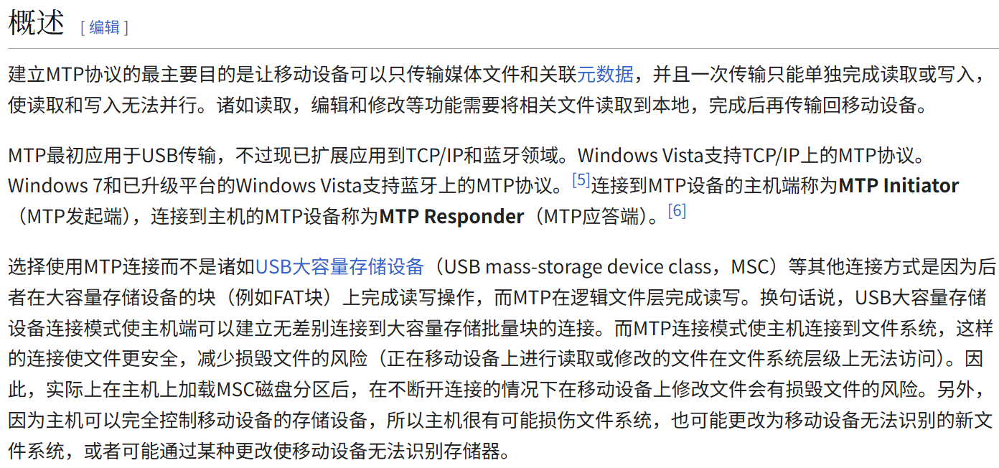

## H723ZGTx144_ThreadX_USBX_PIMA_CDC_01

在 H723ZGTx144_ThreadX_USBX_MSC_CDC_01 的基础上修改，删除 MSC 类，加入 CDC ACM 类，与 PIMA 实现 USBX 复合设备

本工程状态：可以显示MTP盘符，点击可以显示目录，但不能重命名文件、打开文件，由于MTP不支持流式传输，所以放弃MTP，此工程弃用，仅作占坑备份！

## 参考

### PIMA相关帖子

[安富莱论坛：FileX+USBX_MSC_双边同步问题](https://forum.anfulai.cn/forum.php?mod=viewthread&tid=129472&page=1#pid346429)

> *发表于 2025-8-20 09:50:20* | [只看该作者](https://forum.anfulai.cn/forum.php?mod=viewthread&tid=129472&page=1&authorid=84914) |[倒序浏览](https://forum.anfulai.cn/forum.php?mod=viewthread&tid=129472&extra=&ordertype=1) |[阅读模式](javascript:;)
>
> [JasonChen](https://forum.anfulai.cn/home.php?mod=space&uid=84914)
>
> > 目前使用的存储介质是SD卡，进行**fx_media_format**格式化之后，可以被PC正常识别，写入读取都是正常的。 但是存在本地和PC端不同步的问题，比如在本地创建或写入文件，创建或写入后立即调用了**fx_media_flush**，本地已经生效，PC端也不会立即刷新出文件，需要重新枚举才能正常显示。 同样通过PC端写入文件，需要重新**fx_media_open**本地才能看到PC端上次写入的文件。  造成这样的现象，貌似是两边在维护不同的FAT表。请问有什么好的解决方法吗？
> >
> > 弃用MSC了，改为PIMA MTP，由设备端统一管理文件系统，可以完美兼容
>
> [eric2013](https://forum.anfulai.cn/home.php?mod=space&uid=58)：
>
> > 是的mtp是非常好的方案
>
> [walk](https://forum.anfulai.cn/home.php?mod=space&uid=20152)
>
> > mtp有demo吗，官方的demo怎么把默认目录下的文件罗列出来，没用文件夹的层次信息。
>
> [eric2013](https://forum.anfulai.cn/home.php?mod=space&uid=58)
>
> > 我们自己没做过，只有官方的那个Demo
>
> OldGerman：
>
> > 楼主非常感谢你提到PIMA，其实手机和电脑传文件就在用这个协议，但是我之前一直以为是MSC哈哈
> >
> > 我目前卡壳儿的情况和楼主非常相似，ThreadX USBX整了一个MSC和CDC ACM的复合设备，电脑可以读写SD卡，通过虚拟串口发送一个FileX 读写测速SD卡的命令，安富莱的测速例程也能跑完，但是这之后电脑就不能打开SD卡的任何文件了（点击后一直转圈），又过了一会儿windows就把USBX整个设备都卸载了，尝试了FileX读写测速期间仅取消注册USBX 复合设备中的MSC线程，测速完毕后重新注册线程，但情况依然，表现为电脑右键U盘弹出，U盘仍然在电脑上，感觉复合设备是不能热卸载和热重载其中的一个设备类的，wiki搜索了一下PIMA确实相比MSC优势很大，那么就换PIMA MTP开整
> >
> > 
>
> [walk](https://forum.anfulai.cn/home.php?mod=space&uid=20152)
>
> > 我也折腾很久，传大文件没有实时进度，果断放弃USBX，转向使用CherryUSB
> > PIMA MTP也折腾过，主要问题是只能浏览一个文件夹的文件；子文件夹、兄弟文件夹、父文件夹里面的文件不知道怎么处理，文件多的话，占用内存是不是很大?
>
> [OldGerman](https://forum.anfulai.cn/home.php?mod=space&uid=47676)
>
> > 谢谢回复，占用内存这个问题我没有测试过就不打算继续折腾MTP了
> >
> > 今天早上折腾了一下PIMA MTP，发现在这种协议下，windows双击播放或查看手机内部的视频或者图片，实际播放的视频文件或查看的图片文件名后面会多一个[1]后缀，打开其所在路径是在一个Cache文件夹下，这说明电脑通过PIMA访问手机的文件都需要先拷贝整个文件的副本到电脑里，然后才打开这个文件副本
> > 问了一下AI老师：MTP协议无法像访问本地硬盘一样直接读取手机文件，必须先将数据从手机传输到电脑内存或临时存储，不支持流式传输，实测了一下确实，不支持重名文件，而且拷贝文件时不能显示读写速度。。。
> >
> > 所以我果断放弃PIMA，又用回来MSC，今晚还是最终使用楼主的方式凑活用：电脑重新单独枚举复合设备中的MSC+本地重新fx_media_open来解决双边同步问题
>

## MTP协议相比MSC协议的优势

维基百科：


## MTP协议相比MSC协议的劣势

豆包：MTP协议相比MSC协议的十大劣势

> ## 1. **传输性能低下**
>
> - **传输速度慢**：USB 2.0环境下MTP实际速率仅20-30MB/s，而MSC可达40-50MB/s，约低12-25% 
> - **大文件传输效率差**：单个大文件传输时速度明显落后，实测大型视频文件传输慢20-30% 
> - **小文件批量传输灾难**：传输10,000个10KB小文件需30分钟以上，而MSC仅需数分钟 
>
> ## 2. **文件操作严重受限**
>
> - **无法直接编辑文件**：必须先将文件复制到本地修改，再复制回设备，浪费双倍时间和带宽 
> - **不支持并行读写**：一次只能执行读或写操作，无法同时进行，严重降低效率 
> - **文件大小限制**：部分设备在MTP模式下无法传输1GB以上单个文件 
>
> ## 3. **系统与设备兼容性差**
>
> - **操作系统支持不足**：
>   - Windows原生支持，但Linux和macOS需额外驱动且功能不完善 
>   - Android 4.0前默认使用MSC，后期才兼容MTP 
> - **外设支持匮乏**：
>   - DVD播放器、汽车音响系统等传统设备几乎不支持MTP，只能识别MSC设备 
>   - 嵌入式设备、智能电视对MTP兼容度低，普遍仅支持MSC模式 
>
> ## 4. **元数据管理开销巨大**
>
> - **内存占用爆炸**：存储10万个文件需800MB+内存专用于维护文件列表，MSC几乎无此开销 
> - **初始化慢如蜗牛**：
>   - 1,000个文件需3.2秒初始化
>   - 10,000个文件需21.5秒
>   - 50,000个文件需近2分钟 
> - **数据库负担**：每次文件操作都需查询和更新设备端数据库，增加CPU和电池消耗 
>
> ## 5. **协议架构设计缺陷**
>
> - **串行通信模型**：采用"请求-响应"机制，即使简单目录浏览也需多次往返 
>
>   ```c
>   主机："你有多少文件？"
>   设备："1000个"
>   主机："第1个叫什么？"
>   设备："file1"
>   主机："第2个叫什么？"
>   ...（重复1000次）
>   ```
>
> - **单线程处理**：所有请求（包括文件传输和设备状态查询）由同一线程顺序处理，大文件传输会阻塞所有其他操作 
>
> ## 6. **文件系统访问受限**
>
> - **完全隔离底层**：MTP阻止主机直接访问设备文件系统，无法执行以下操作 
>   - 使用磁盘恢复工具修复损坏分区
>   - 直接查看或修改系统文件
>   - 执行文件系统级维护
> - **SD卡支持问题**：部分设备在MTP模式下无法显示或访问SD卡内容 
>
> ## 7. **错误处理与恢复能力弱**
>
> - **故障排查困难**：设备端文件系统错误时，MTP无法提供详细诊断信息 
> - **恢复工具失效**：传统数据恢复软件（如Encase、取证大师）无法用于MTP设备 
> - **系统崩溃风险**：在处理大量文件或复杂目录结构时，MTP服务容易崩溃 
>
> ## 8. **设备功能受限**
>
> - **充电性能影响**：部分设备在MTP模式下充电速度降低，因带宽被数据传输占用 
> - **设备响应延迟**：文件传输时设备UI响应变慢，特别是在处理大量小文件时 
> - **系统资源消耗**：MTP服务占用设备CPU和内存，减少可用资源给其他应用 
>
> ## 9. **跨平台互操作性差**
>
> - **文件属性丢失**：传输过程中部分文件元数据（如权限、创建时间）可能丢失或损坏 
> - **格式兼容性问题**：
>   - 不支持某些特殊文件系统（如ext4、NTFS）的完整特性 
>   - 长文件名或特殊字符处理不稳定 
>
> ## 10. **部署与维护成本高**
>
> - **设备端实现复杂**：需要额外代码实现MTP服务，增加开发和测试工作量 
> - **功耗增加**：设备端MTP服务持续运行消耗更多电量，缩短电池使用时间 
> - **兼容性测试负担**：厂商需针对不同操作系统和设备型号进行大量兼容性测试 
>
> 